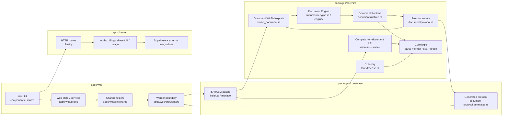
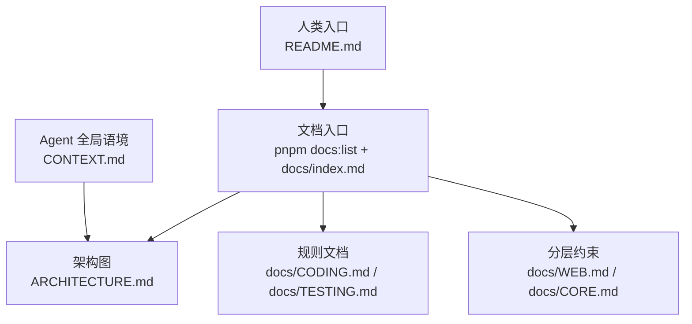

# Treease 架构总览

## 单一职责

本文只回答一个问题：Treease 顶层模块如何分层，依赖方向如何流动。

不在本文重复领域术语、协议字段、测试策略、编码规则或模块内部职责：

- Document Runtime 语境：`CONTEXT.md`
- 编码规则：`docs/CODING.md`
- 测试策略：`docs/TESTING.md`
- Web 约束：`docs/WEB.md`
- Core 约束：`docs/CORE.md`
- 文档入口：先运行 `pnpm docs:list`，再按 `docs/index.md` 选择主题文档

## 顶层依赖图

- `Web UI`：承载 Svelte 组件、页面入口和用户交互，不包含 Core 计算逻辑。
- `Web state / services`：承载前端状态、设置、服务编排和图形辅助逻辑，只通过 Worker 使用 Core 能力。
- `Shared helpers`：Worker 与 UI 共享的纯辅助函数（tree node value、stored analysis、path、document edits），不承载状态或 authority。
- `Worker boundary`：承载浏览器到 WASM 的消息边界、请求关联、fan-out 和统一错误出口。
- `HTTP routes`：承载 `Treease Server` 的公开 API 入口，不承载 Core 文档计算。
- `Auth / billing / share / AI / usage`：承载账号会话、订阅、公开分享、`suggest-yq` 与 credits 用量编排。
- `Supabase + external integrations`：承载 Supabase Auth / storage、AI gateway 等外部服务访问。
- `TS WASM adapter`：负责 TypeScript 侧 WASM 装载、内存交互和导出函数适配，拆分为 document API 与 compat API 两套表面。
- `Generated protocol`：由 Rust 协议导出的 TypeScript 类型生成物，供 Worker / UI 消费。
- `Document WASM exports`：暴露 Document Runtime 的 WASM API，是主文档链路进入 Rust runtime 的边界。
- `Compat / non-document ABI`：保留兼容或非 document 能力（parse、format、value edit 等），不定义主文档协议。
- `Protocol source`：定义跨边界 document protocol，是生成 TypeScript 协议的源头。
- `Document Engine`：持有 streaming/batch 推进、job、snapshot、projection 与 materialize 的运行时语义。
- `Document Runtime`：持有 job/snapshot 的 authority、freshness、snapshot-bound read 与资源管理语义。
- `Core logic`：提供解析、格式化、求值和 graph 构建等可复用核心能力。
- `CLI entry`：承载命令行入口和参数编排，复用 Core 能力。

## 读图规则

- 运行时依赖只沿箭头方向流动；Web 不直接调用 `packages/core/src` 内部实现。
- `document/protocol.rs` 是 document protocol 的源头，`document-protocol.generated.ts` 是生成物。
- `wasm_document.rs` 是 Document Runtime 的 WASM 导出边界。
- `wasm.rs` + `wasm/` 模块只保留兼容或非 document ABI，不定义主文档协议。
- `apps/server` 不重做 parse / format / eval / graph build；它只承载账号、计费、分享与 AI 配套服务。
- Worker 是 transport / correlation / fan-out 边界；Document Runtime 的 authority、freshness、snapshot 语义见 `CONTEXT.md`。

## 文档入口关系

