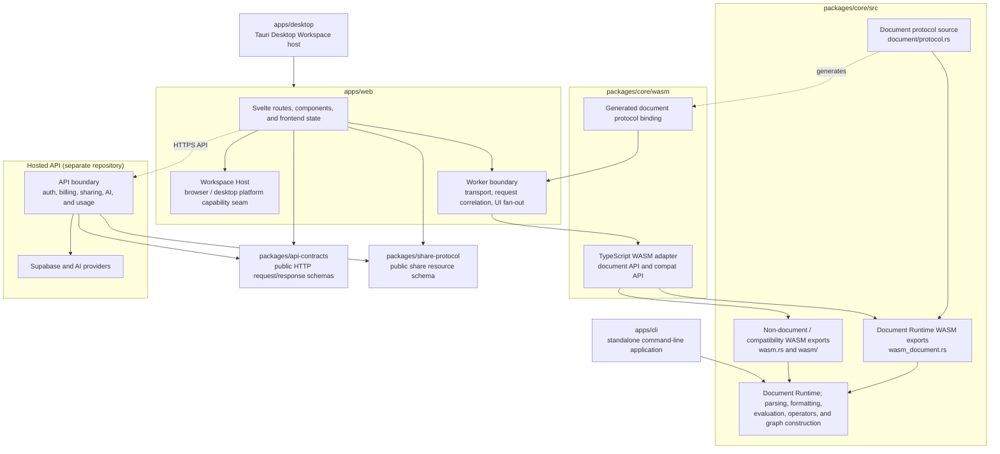

# Treease Architecture Overview

## Single Responsibility

This document answers one question: how Treease's top-level modules are layered and how dependencies flow between them.

## Top-Level Dependency Diagram

- `apps/web` is the frontend shared by the browser workspace and desktop application. It owns presentation, interaction, and frontend state; it does not implement Core document computation.
- `apps/desktop` is the Tauri host for desktop packaging and platform capabilities. Shared UI accesses those capabilities through `Workspace Host`, not through direct Tauri API coupling.
- The Hosted API is the product-service boundary for accounts, billing, sharing, AI, and usage. Its implementation is maintained outside this repository and does not duplicate parsing, formatting, evaluation, or graph construction.
- `packages/core` is the sole implementation of document computation. `packages/core/wasm` adapts only its WASM surface, which Web accesses through the Worker.
- `apps/cli` reuses `treease-core` computation while independently owning command-line arguments, I/O, and user-visible CLI contracts.

## Reading the Diagram

- Solid arrows represent dependency or host relationships; dashed arrows represent generated artifacts or runtime calls. Web never calls internal implementations in `packages/core/src` or the Hosted API repository directly.
- `packages/api-contracts` is the public HTTP boundary. It contains client-visible schemas only; Server repositories, provider integrations, and billing models remain private implementation details.
- `packages/share-protocol` owns serialized share resources, while API envelopes and errors belong to `packages/api-contracts`.
- `packages/core/src/document/protocol.rs` is the sole source of truth for the Document Protocol; `packages/core/wasm/document-protocol.generated.ts` is generated output.
- `packages/core/src/wasm_document.rs` is the Document Runtime WASM export boundary. `packages/core/src/wasm.rs` and `packages/core/src/wasm/` contain only non-Document-Runtime or compatibility ABI.
- The Worker is the browser-to-WASM transport, request-correlation, and UI fan-out boundary. See `docs/contracts/document-runtime.md` for Document Runtime authority, freshness, and snapshot semantics.
