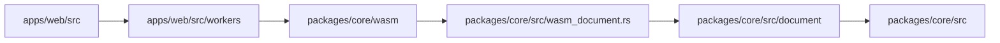

# Treease

## 项目目标
- Treease 由 `apps/cli/`、`apps/web/` 与 `packages/core/` 组成，分别负责 CLI、Web UI/Worker 和可复用 Core 能力。

## 快速入口
- Agent 最短路径：`docs/agent-entrypoints.md`
- Agent 全局语境：`CONTEXT.md`（只在 protocol / runtime / snapshot 相关任务时补读）
- 架构总览：`ARCHITECTURE.md`
- 文档索引：`docs/README.md`
- CLI 入口：`apps/cli/AGENTS.md`
- Web 入口：`apps/web/AGENTS.md`
- Core 入口：`packages/core/AGENTS.md`

## 核心链路
- neo-rs 主文档链路：`apps/web/src/lib/components/Editor.svelte`（核心实现在 `Editor/EditorCore.svelte`）→ `apps/web/src/workers/wasm-runtime.worker.ts` → `packages/core/wasm/index.ts` → `packages/core/src/wasm_document.rs` → `packages/core/src/document/`
- 图形视图链路：`GraphViewer.svelte / ViewportPanel.svelte` → `graph-render-session.ts` / `graph-scene-runtime.ts` → `apps/web/src/workers/runtime/document-job.ts` / `graph-stream-events.ts` → WASM 适配层 → `packages/core/src/core/graph_builder.rs` → `GraphDelta`
- neo-rs 文档协议链路：`packages/core/src/document/protocol.rs` → `cargo run --locked --bin export_document_protocol` → `packages/core/wasm/document-protocol.generated.ts` → worker / UI 消费

## 常用命令
- Web：在 `apps/web/` 执行 `pnpm dev`、`pnpm build`、`pnpm test`
- Web 分层测试：在 `apps/web/` 执行 `pnpm test:unit`、`pnpm test:integration`、`pnpm test:e2e`
- neo-rs 文档协议：在 `packages/core/` 执行 `cargo run --locked --bin export_document_protocol`
- WASM 构建 / 协议生成：在 `apps/web/` 执行 `pnpm wasm:bindgen`；影响运行时编解码时继续执行 `pnpm wasm:sync`
- Core：在 `packages/core/` 执行 `cargo nextest run --locked`；fixture corpus 可执行 `cargo nextest run --locked --test corpus_runner --no-capture`
- Core 辅助生成：在 `packages/core/` 执行 `cargo run --locked --bin export_language_support`、`cargo run --locked --bin sync_examples`、`cargo run --locked --bin export_registry_doc`
- CLI：默认实现是 `packages/core/src/cli.rs`；在 `packages/core/` 执行 `cargo nextest run --locked --lib cli::`、`cargo run --locked --bin treease -- [args]`，在 `apps/cli/` 执行 `bash tests/acceptance/run.sh`
- 文档一致性：在仓库根目录执行 `node scripts/check-docs.mjs`

## 当前技术栈
- Core：`packages/core/rust-toolchain.toml` 固定 Rust `1.95.0`
- CLI：目录入口见 `apps/cli/AGENTS.md`
- Web：TypeScript `5.9.3`、Svelte `5`、SvelteKit `2`、Vite `^8`
- CI：Node `20`、pnpm `9`

## 当前 CI
- `core-tests`：当前 workflow 位于 `.github/workflows/core.yml`
- `web-tests`：当前 workflow 位于 `.github/workflows/web.yml`（先跑覆盖率，再跑 E2E core）
- 文档一致性：在 `web-tests` 内执行 `node scripts/check-docs.mjs`

## 文档地图
- 完整索引见 `docs/README.md`。
- Agent 领域术语与 neo-rs 规范见 `CONTEXT.md`。
- 全局规则：`docs/CODING.md`、`docs/TESTING.md`、`docs/FRONTEND.md`、`docs/CORE.md`
- 产品与能力参考：`docs/user-stories.md`、`docs/operators/README.md`、`docs/usage/README.md`、`docs/references/core/README.md`

## 高频任务
- 修改 neo-rs 文档协议字段：先改 `packages/core/src/document/protocol.rs`，再在 `packages/core/` 执行 `cargo run --locked --bin export_document_protocol`
- `pnpm wasm:bindgen` 已重新用于 neo-rs 文档协议生成：运行 `cargo run --locked --bin export_document_protocol` + `wasm-pack build`；旧 `types.json` / 旧 binding 体系已清理删除。
- 调整 CLI 行为：先读 `apps/cli/AGENTS.md` 与 `packages/core/src/tools/treease.rs`
- 调整 Web 行为：先读 `docs/FRONTEND.md` 与 `apps/web/src/AGENTS.md`
- 调整 Core 能力：先读 `docs/CORE.md` 与 `packages/core/src/AGENTS.md`

## 维护原则
- 根入口只保留导航与稳定事实，不堆叠实现细节；人类读者从本文件进入。
- 仓库内文档必须能映射到真实路径、命令、版本和 CI。
- 详细的实现说明优先写入 `docs/` 或模块目录，而不是继续膨胀根 README。
