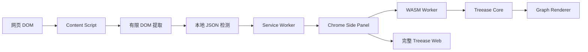

# Treease Chrome 扩展：点击 JSON 后在侧边栏展示 Graph

## 1. 文档信息

- 状态：Draft
- 版本：v0.1
- 产品：Treease Chrome Extension
- 目标平台：Chrome Manifest V3
- 目标用户：开发者、测试工程师、数据分析师、API 调试和技术文档阅读者
- 关联能力：Treease Web、Treease Core/WASM、Graph、路径追踪、JSON 结构解析

## 2. 一句话定义

用户在任意网页上点击包含 JSON 的 DOM 元素，扩展自动识别并在 Chrome 右侧 Side Panel 中展示 Treease Graph；JSON 默认只在本地处理，不上传网页内容。

## 3. 背景与问题

开发者经常在以下场景遇到难以阅读的结构化数据：

- API 响应页或 Network 面板中的 JSON
- 文档网站中的 JSON 示例
- `<pre>`、`<code>`、`textarea` 中的配置和接口数据
- 页面表格、调试工具或日志中的嵌入式 JSON

当前用户通常需要复制内容、打开独立工具、粘贴数据，再切换回网页。这个过程打断上下文，也无法保留用户正在查看的页面位置。

Treease 已具备 JSON 解析、Graph 展示、字段路径追踪和结构化分析能力。Chrome 扩展的职责应是捕获网页上下文并把数据送入侧边栏，而不是重新实现完整编辑器。

## 4. 产品目标

### 4.1 MVP 目标

1. 安装后能够在用户授权的网站持续监听左键点击。
2. 能够从被点击 DOM 及有限范围的祖先节点提取文本。
3. 能够识别文本是否为合法 JSON。
4. 检测成功后，在当前标签页右侧 Side Panel 展示 Graph。
5. JSON 解析和 Graph 构建默认在本地完成。
6. 侧边栏能够随着用户后续点击更新当前数据。
7. 产品能够清晰解释网站访问权限和网页数据处理方式。

### 4.2 非目标

- 不拦截、修改或分析网络请求。
- 不读取 cookies、密码、表单提交内容或浏览历史。
- 不扫描整页 DOM，也不建立全量网页内容索引。
- 不在扩展中实现账号、计费、广告或用户画像。
- 不在 Popup 内重做完整 Treease 编辑器。
- 不保证在 `chrome://`、Chrome Web Store、受限 PDF 页面和浏览器内部页面运行。

## 5. 核心用户流程

```text
用户打开网页
  ↓
用户点击 JSON 相关 DOM
  ↓
Content Script 捕获 click
  ↓
提取目标元素及有限祖先节点的文本
  ↓
本地清洗并执行 JSON.parse
  ├─ 失败：不打扰用户，可显示轻量提示
  └─ 成功：发送结构化数据到 Service Worker
              ↓
         打开或更新 Side Panel
              ↓
         Treease Graph 展示结构
```

## 6. 用户故事

### US-01：点击 JSON 查看 Graph

作为开发者，我希望点击网页中的 JSON 后直接看到结构图，以便快速理解嵌套关系，而不必复制到其他工具。

验收标准：

- 点击合法 JSON 后，当前标签页的 Treease Side Panel 获得数据。
- Graph 能展示对象、数组和嵌套层级。
- 侧边栏能够显示解析失败、内容过长等明确状态。

### US-02：保持网页上下文

作为开发者，我希望网页内容保持在左侧，Graph 固定在右侧，以便对照查看。

验收标准：

- Side Panel 使用 Chrome 原生右侧面板，不注入覆盖式浮层。
- 网页滚动、点击和导航不应被扩展阻断。
- Side Panel 关闭后，网页恢复正常显示。

### US-03：本地处理敏感数据

作为开发者，我希望 API 响应和配置数据不会离开本机。

验收标准：

- MVP 不上传捕获文本、解析结果或网页内容。
- 默认不保存捕获内容到云端。
- 隐私说明明确声明本地处理范围。

### US-04：控制监听范围

作为用户，我希望能够暂停扩展，或只在指定网站启用。

验收标准：

- 能够暂停全部网站监听。
- 能够暂停当前网站监听。
- 重新启用后不需要重新安装扩展。

## 7. 功能需求

### 7.1 点击监听

扩展通过 Content Script 在页面文档级别监听捕获阶段的 `click` 事件。

监听要求：

- 只处理左键点击。
- 忽略扩展自身页面和浏览器内部页面。
- 不阻止、不延迟、不修改原始点击事件。
- 对连续点击做节流或去重，避免同一数据重复解析。
- 对动态页面兼容，不依赖页面初始 DOM 快照。

### 7.2 DOM 提取策略

按以下优先级尝试提取候选文本：

1. `input`、`textarea` 的 `value`。
2. 被点击元素的 `textContent`。
3. 最近的 `pre`、`code`、`textarea` 或相关容器。
4. 有限层级的祖先节点文本。

约束：

- 默认只向上查找有限层级，例如最多 3 层。
- 单次候选文本超过 1 MB 时停止解析。
- 不对 `body`、`html` 或整页容器执行 `textContent` 读取。
- 清理 Markdown code fence 后再尝试解析，例如 ```json ... ```。
- 首版只接受严格 JSON，不自动把 JavaScript object literal、单引号对象或 YAML 当作 JSON。

### 7.3 JSON 检测

检测结果至少包含：

- 是否成功解析。
- 原始文本长度。
- JSON 根类型：object、array、scalar。
- 来源元素类型。
- 当前页面 URL 的域名信息是否需要展示。
- 错误位置和简短错误原因。

解析默认在 Side Panel 或独立 Worker 中完成，避免阻塞页面主线程。

### 7.4 Side Panel

使用 Chrome `sidePanel` API 展示扩展 UI。Chrome 114+ MV3 支持该 API；通过 `sidePanel.open()` 打开面板时必须处于用户操作上下文。

Side Panel MVP 包含：

- Graph 画布。
- 加载中状态。
- 非法 JSON 状态。
- 内容过大状态。
- 空状态和使用提示。
- 当前节点路径展示。
- 复制 JSONPath。
- 在完整 Treease Web 中打开。

### 7.5 自动打开策略

用户点击网页元素后，Content Script 将结果发送给 Service Worker。由于 `sidePanel.open()` 需要用户操作上下文，异步消息转发后是否能稳定保留 user gesture 需要在目标 Chrome 版本中验证。

产品要求采用双路径：

- 如果 Side Panel 已打开：收到合法 JSON 后立即更新 Graph。
- 如果 Side Panel 未打开：尝试自动打开。
- 自动打开失败：在页面显示非阻塞的轻量提示，提示用户点击扩展图标打开 Side Panel；数据仍保留在当前标签页的短期内存状态中。

自动打开失败不能导致页面报错、点击失效或数据丢失。

## 8. 权限设计

### 8.1 初始权限建议

```json
{
  "permissions": [
    "sidePanel",
    "storage"
  ],
  "host_permissions": [
    "<all_urls>"
  ]
}
```

是否需要 `scripting` 取决于 Content Script 的注入方式：

- 使用 manifest 静态注入时，通常不需要 `scripting`。
- 使用运行时动态注入时，需要额外评估并申请 `scripting`。

MVP 不申请：

- `webRequest`
- `webRequestBlocking`
- `declarativeNetRequest`
- `debugger`
- `tabs`
- `cookies`
- `clipboardRead`
- `downloads`

### 8.2 权限与审核解释

`<all_urls>` 用于持续监听用户点击的页面元素，并只提取被点击元素附近的候选文本，以便判断其是否为 JSON 并在用户可见的 Side Panel 中展示 Graph。

产品不得将网站访问权限用于：

- 后台收集浏览历史。
- 用户行为分析。
- 广告定位。
- 向第三方出售或共享网页内容。
- 与 JSON Graph 功能无关的数据采集。

Chrome 最低权限政策要求权限与当前产品功能直接相关，并要求在商店页面和产品界面中解释权限用途。

## 9. 隐私与数据处理

### 9.1 数据生命周期

```text
点击元素
  ↓
内存中提取候选文本
  ↓
本地 JSON.parse / WASM Graph 构建
  ↓
Side Panel 展示
  ↓
切换标签页、关闭面板或超时后释放
```

### 9.2 默认行为

- 不向 Treease Cloud 或其他服务器上传网页内容。
- 不保存完整 URL 历史。
- 不保存所有点击记录。
- 不读取 cookies、localStorage、密码和表单提交内容。
- `storage` 仅用于保存用户开关、站点禁用列表和 UI 偏好。

### 9.3 必须准备的合规材料

- Chrome Web Store 单一用途说明。
- 权限用途说明。
- 隐私政策。
- 首次使用时的显著隐私提示和用户确认。
- “不上传网页内容、仅本地解析”的明确声明。
- 测试步骤，说明如何点击 JSON 并查看 Graph。

即使数据完全本地处理，网页内容和浏览活动仍需按 Chrome 用户数据规则披露。

## 10. 技术架构



建议新增一个独立扩展入口，而不是把整个 Web 应用直接塞进 Popup：

```text
apps/extension/
  src/content/
  src/background/
  src/sidepanel/
  src/shared/
  public/manifest.json
```

复用现有 Treease Core/WASM 的解析和 Graph 构建能力。扩展层只负责：

- 浏览器事件监听。
- DOM 候选提取。
- Service Worker 消息路由。
- Side Panel 生命周期。
- 扩展权限和用户设置。

## 11. 失败和边界场景

| 场景 | 预期行为 |
|---|---|
| 点击普通文本 | 不打扰用户，不打开面板 |
| 点击非法 JSON | 显示轻量提示或保持静默 |
| 点击 Markdown JSON code fence | 清理 fence 后尝试解析 |
| JSON 超过大小上限 | 显示“内容过大” |
| 页面频繁重渲染 | 通过事件委托继续工作 |
| iframe 内 JSON | MVP 默认只处理顶层页面；后续再支持 all_frames |
| Shadow DOM | MVP 不保证，记录为后续兼容项 |
| chrome:// 页面 | 不注入，正常不可用 |
| Side Panel 自动打开失败 | 保留数据并提示用户点击扩展图标 |
| Graph 构建失败 | 展示原始解析错误，不影响网页 |

## 12. 性能要求

- 普通点击的扩展额外处理耗时目标低于 5 ms，不应阻塞页面交互。
- 非候选元素不得触发大范围文本读取。
- 相同元素和相同文本在短时间内去重。
- JSON 解析在 Worker 或 Side Panel 线程完成。
- 页面加载后不主动扫描整棵 DOM。
- Graph 节点数量较大时复用 Treease 现有虚拟化策略。

## 13. MVP 验收标准

### P0

- [ ] Manifest V3 扩展可安装并在授权网站运行。
- [ ] 能捕获顶层页面左键点击。
- [ ] 能从 `pre`、`code`、`textarea` 中提取候选文本。
- [ ] 能识别合法 JSON 和非法 JSON。
- [ ] 合法 JSON 能在当前标签页 Side Panel 展示 Graph。
- [ ] Side Panel 关闭或打开状态都不会破坏网页交互。
- [ ] 无网络上传网页内容。
- [ ] 处理 JSON 大小上限和解析异常。
- [ ] 提供暂停全部网站和暂停当前网站能力。

### P1

- [ ] 支持点击任意嵌套 DOM 后向上寻找最近 JSON 容器。
- [ ] 支持节点路径搜索和 JSONPath 复制。
- [ ] 支持 Graph 与原始 JSON 对照查看。
- [ ] 支持在完整 Treease Web 中打开当前数据。
- [ ] 支持站点级启用/禁用。

### P2

- [ ] 支持 DevTools Network 响应发送到 Treease。
- [ ] 支持 iframe。
- [ ] 支持 Shadow DOM。
- [ ] 支持 YAML、TOML 和嵌入式 payload 识别。

## 14. 成功指标

MVP 上线后重点观察：

- JSON 点击识别成功率。
- 合法 JSON → Graph 展示成功率。
- 自动打开 Side Panel 成功率。
- 用户主动关闭或暂停扩展的比例。
- 页面性能异常和用户投诉数量。
- 扩展安装后 7 日留存。

建议先通过埋点记录匿名技术指标，不记录网页 URL、网页文本或 JSON 内容。

## 15. 主要风险与对策

### 风险一：自动打开 Side Panel 不稳定

原因是 `sidePanel.open()` 受 user gesture 限制，而 Content Script 到 Service Worker 的异步消息可能丢失用户操作上下文。

对策：面板已打开时自动更新；未打开时尝试打开，并准备扩展图标点击的可靠降级路径。

### 风险二：`<all_urls>` 引发用户和审核担忧

对策：权限说明、首次使用确认、默认本地处理、站点级暂停、最小化 DOM 读取、不保留数据。

### 风险三：误读取敏感页面内容

对策：不读取表单提交、密码字段和 cookies；默认排除敏感控件；不把候选文本发送到服务器。

### 风险四：点击监听造成性能影响

对策：事件委托、候选元素白名单、祖先层级限制、文本长度限制、去重和 Worker 解析。

### 风险五：Treease Web 与扩展 Graph 代码重复

对策：复用 Treease Core/WASM 和现有 Graph 投影能力，扩展只新增浏览器适配层。

## 16. 发布与审核策略

商店单一用途建议表述：

> Treease 将用户点击的网页结构化文本识别为 JSON，并在 Chrome Side Panel 中以可视化 Graph 展示。网页内容仅在本地处理，不会上传到服务器。

权限说明建议表述：

> 需要访问网页内容，是为了读取用户点击元素附近的文本并判断其是否为 JSON。扩展不会读取 cookies、密码或网络请求，也不会记录用户的浏览历史。

首次运行时应展示同等内容，并让用户明确开启网页监听。

## 17. 开放问题

1. 自动打开失败时，是否允许在页面右下角显示一次性提示？
2. MVP 是否只处理 `pre/code/textarea`，还是同时支持任意 DOM 的有限祖先搜索？
3. 是否需要在 Graph 中显示来源页面标题和域名？
4. 扩展是否与 Treease Web 使用同一套视觉主题？
5. Treease Community License 是否允许该扩展作为商业分发产品发布，需要在上线前确认。

## 18. 参考资料

- [Chrome Side Panel API](https://developer.chrome.com/docs/extensions/reference/api/sidePanel)
- [Chrome Content Scripts](https://developer.chrome.com/docs/extensions/develop/concepts/content-scripts)
- [Chrome Declare Permissions](https://developer.chrome.com/docs/extensions/develop/concepts/declare-permissions)
- [Chrome Web Store User Data Policy](https://developer.chrome.com/docs/webstore/user_data)
- [Chrome Web Store Single Purpose Policy](https://developer.chrome.com/docs/webstore/program-policies/quality-guidelines-faq/)
- [Chrome declarativeNetRequest](https://developer.chrome.com/docs/extensions/reference/api/declarativeNetRequest)
- [uBlock Origin Permissions](https://github.com/gorhill/uBlock/wiki/Permissions)
