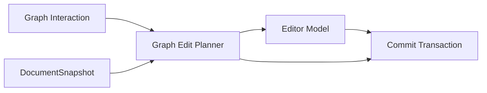

# Bidirectional Edit Contract

This document explains the primary `Editor <-> Graph` bidirectional-edit path: the participating entities, the flows in both directions, and the boundaries that must never be bypassed.

It describes only `Editor <-> Graph` bidirectional editing:

- Bidirectional-edit constraints
- Data flows in both directions
- Core entity relationships directly related to bidirectional editing

## Core Entities

### Editor Model

The draft entity that receives text edits and applies edits.

### Graph Interaction

Editing entry points from the primary graph, column-navigator Column Rails, and column detail editors.

### Graph Edit Planner

The planning entity that generates edits or a replace fallback from a snapshot and path.

### Commit Transaction

Resubmits bidirectional-edit results into the primary-document path.

### DocumentSnapshot

Provides the snapshot identity and structural semantics required by the planner.

## Core Entity Relationships



## Bidirectional-Edit Constraints

### Editor → Graph

- When Editor changes flow back to the graph, the commit must return through the primary-document commit entry point.
- Incremental edits must bind a base snapshot.
- Graph semantics must not create a separate successful primary path that updates only the graph and not the document.

### Graph → Editor

- Graph must not write the document directly.
- Graph must go through the planner first.
- The planner must bind `documentKey + snapshotId + path`.
- When the planner returns edits, they must flow back through `Editor Model`.
- When the planner returns replace, it must explicitly follow whole-document commit semantics.

### fallback

- Fallbacks must be explicit.
- The fallback reason must be visible and traceable.
- Silent no-ops are forbidden.

## Data Flow

### 1. Editor → Graph

```text
Editor change
  → Editor Model
  → Commit Transaction
  → Document Runtime
  → New snapshot / new graph
```

### 2. Graph → Editor

```text
Graph interaction
  → Graph Edit Planner
  → edits / replace
  → Editor Model
  → Commit Transaction
  → Document Runtime
  → New snapshot / new graph
```

### 3. Column Navigator Column Rail

```text
Column Rail inline edit
  → Graph Edit Planner
  → edits / replace
  → Editor Model
  → Commit Transaction
```

### 4. Column Navigator column detail editor

```text
Column Detail Editor Monaco draft
  → Graph Edit Planner
  → edits / replace
  → Editor Model
  → Commit Transaction
```

## Column Navigator Entry-Point Constraints

- The Column Rail and column detail editor in a column navigator are only bidirectional-edit entry points.
- Planner authority does not change by entry point.
- For product rules such as column routing, draft ownership, and Column Navigator lifetime, see `./column-navigator.md`.

## Checklist

- Does Graph bypass the planner and write the document directly?
- Does the planner explicitly bind snapshot identity?
- Do both edits and replace flow back through the unified commit entry point?
- Do different entry points share the same planner semantics?
- Is fallback explicit and visible?
