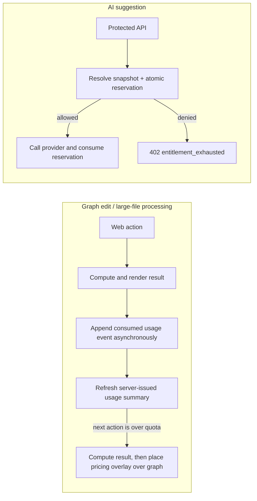

# Billing Entitlements

## Terms and authority

- **Plan tier** is the customer-facing entitlement: `free` or `pro`.
- **Billing cadence** is how a Pro subscription is billed: `monthly` or `yearly`; it is not a separate entitlement tier.
- **Entitlement snapshot** is the resolved, server-issued result for one usage owner. The Web app may display it but must not calculate access from local state.
- **Usage event** is an immutable server-side record of one chargeable action. The ledger, not browser analytics, is the source for quota enforcement.

The server resolves subscriptions from verified Lemon Squeezy webhooks and owns the entitlement snapshot and usage ledger. AI access is server-enforced; local graph and file operations use the server-issued snapshot only to decide whether a computed result remains consumable.

Web and desktop derive a namespaced client ID (`browser:<fingerprint>` or `desktop:<fingerprint>`) when no session exists. Chargeable usage is recorded against `owner_key = client:<clientId>`. After login, the client queue is claimed transactionally into `owner_key = user:<userId>`, and all future events use that user owner. Client IDs are anonymous metering keys, not authentication credentials; the server resolves free entitlements for client owners and subscription entitlements for user owners.

## Pro product limits

| Capability | Free | Pro |
| --- | ---: | ---: |
| Bidirectional-edit documents per calendar month | 10 | Unlimited |
| Large-file visualization or processing runs per calendar month (source file ≥ 500 KB) | 3 | Unlimited |
| Share-link lifetime | 7 days | 365 days |
| AI suggestions per calendar month | 0 | 1,000 |
| Graph, source tracing, structural comparison, import/export | Included | Included |

`monthly` and `yearly` both resolve to **Pro**. A canceled or non-active subscription falls back to Free entitlements when its paid term ends; the webhook payload must supply the paid-through timestamp before that behavior is implemented.

## Enforcement path



`bidirectional_edit` and `large_file_processing` must not wait for a usage request before local computation. After a successful, consumable action, Web records a consumed event asynchronously. Once the server-issued summary says the limit is exhausted, the next local action still computes its graph result, but Web puts a pricing overlay over that result and blocks graph interaction until the entitlement changes. The masked preview is not another consumed usage event.

`ai_suggestion` remains server-enforced: authenticate, resolve the current entitlement, atomically reserve the quota, call the provider, then consume or release the reservation. Do not count browser clicks and do not add a browser-only source of entitlement truth.

## Target server model

`subscriptions` stores payment-provider state, while immutable tables make entitlement and quota decisions auditable.

```text
subscriptions
  user_id (unique), tier (free|pro), billing_cadence (monthly|yearly|null)
  status, current_period_end, provider_subscription_id, provider_variant_id
  last_provider_event_at, updated_at

entitlement_snapshots
  subscription_id, effective_from, effective_to, limits jsonb, features jsonb
  source (webhook|admin), created_at

usage_events
  id, owner_key (client:<id> or user:<id>), user_id (nullable), source_client_id (nullable)
  capability, period_key, quantity, state (reserved|consumed|released)
  idempotency_key, metadata jsonb, created_at, finalized_at
```

`limits` contains named numeric limits such as `ai_suggestions_monthly`; `features` contains explicit booleans such as `large_file_processing`. The entitlement resolver produces a closed result (`allowed`, `quota_exhausted`, `feature_unavailable`) so routes cannot combine nullable limits and booleans incorrectly. `usage_events` must have a unique `(owner_key, period_key, idempotency_key)` index. Non-AI event recording is idempotent but deliberately permits a ledger total above the display limit; AI quota reservation must run in one database transaction or RPC to prevent concurrent provider calls from overspending a limit. Finalization must bind the `owner_key`, and the claim RPC must lock both client and user owners while transferring anonymous events.

## Web analytics contract

Analytics contains no email, user ID, document content, tree path, or provider identifier. It is for funnel diagnosis only and never controls access.

| Event | When | Parameters |
| --- | --- | --- |
| `subscription_viewed` | Signed-in user opens the account menu | `plan`, `status`, `surface` |
| `subscription_management_started` | User opens plan management | `plan`, `status`, `surface` |
| `entitlement_blocked` | A local graph result is masked because the server-issued summary is exhausted, or the AI API denies a gated capability | `plan`, `feature`, `reason`, `surface` |
| `quota_threshold_reached` | Server response indicates 80%, 100% usage | `plan`, `feature`, `threshold`, `surface` |

The first two events are implemented in `apps/web/src/lib/components/AccountMenu.svelte`. The latter two are added at the shared API-error/upgrade prompt boundary when those capabilities are introduced, not at each individual button.
