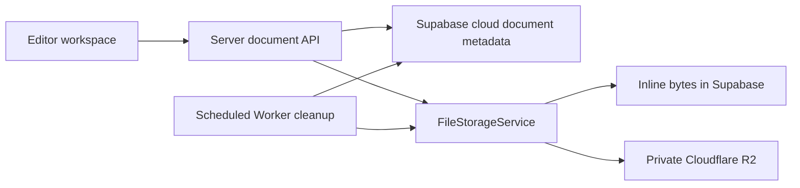

# Cloud Documents Contract

## Decision

Cloud documents are private, account-owned editor documents. Version bodies are stored through [User File Storage](./file-storage.md); document metadata, ownership, revision ordering, and trash state live in Supabase.

Version 1 supports one user editing from multiple devices with optimistic revision control. It does not use Realtime, CRDTs, or collaborative cursors. A concurrent save is rejected rather than silently merged.



## Scope and non-goals

- A cloud document is private to its owner until the owner explicitly creates a share.
- A cloud save persists source text, language, name, and revision metadata. It does not persist graph view state, derived runtime snapshots, cursor position, or editor UI layout.
- A share of a cloud document is an immutable serialized snapshot. It is never a live pointer to the cloud document.
- V1 does not merge concurrent edits, provide offline cross-device synchronization, or expose direct browser access to Supabase tables or R2.
- Local files remain local. Converting a local file into a cloud document creates a new cloud-backed document and ends automatic writes to the local file.

## Terms and invariants

### Cloud document

`cloud_documents` is the stable, owner-scoped identity and current revision pointer for a document.

### Cloud document version

`cloud_document_versions` is an immutable source-text revision. It references exactly one durable `file_objects` record.

### Revision

`revision` is a monotonically increasing integer, starting at `0` for an empty new document. It is an application concurrency token, not an R2 ETag.

The following invariants are mandatory:

1. Only the document owner may list, read, write, rename, trash, restore, or permanently delete a cloud document.
2. A successful content write creates exactly one new immutable version and advances `head_revision` in the same database transaction.
3. A write advances the head only when the supplied expected revision equals the current `head_revision`.
4. `head_revision = 0` means no version exists; otherwise exactly one version exists at `head_revision`.
5. A version body is durable while its version is retained. It has `retention_kind = 'durable'` and no expiration timestamp.
6. A tab has exactly one persistence backing: transient, local file, or cloud document. No save path may dual-write a local file and a cloud document.
7. Server-owned APIs are the only paths to document metadata and bytes. A document ID is not an authorization credential.

## Database model

Add the following Server migration after the file-storage migration:

```sql
create table public.cloud_documents (
  id uuid primary key default gen_random_uuid(),
  owner_id uuid not null,
  name text not null check (char_length(name) between 1 and 255),
  language_id text not null,
  head_revision integer not null default 0 check (head_revision >= 0),
  created_at timestamptz not null default now(),
  updated_at timestamptz not null default now(),
  deleted_at timestamptz,
  purge_at timestamptz,
  check (
    (deleted_at is null and purge_at is null)
    or
    (deleted_at is not null and purge_at is not null)
  )
);

create table public.cloud_document_versions (
  id uuid primary key default gen_random_uuid(),
  document_id uuid not null references public.cloud_documents(id) on delete restrict,
  revision integer not null check (revision > 0),
  file_id uuid not null references public.file_objects(id) on delete restrict,
  language_id text not null,
  created_at timestamptz not null default now(),
  unique (document_id, revision),
  unique (file_id)
);

create index cloud_documents_owner_updated_idx
  on public.cloud_documents (owner_id, updated_at desc)
  where deleted_at is null;

create index cloud_documents_owner_purge_idx
  on public.cloud_documents (owner_id, purge_at)
  where deleted_at is not null;

create index cloud_document_versions_document_revision_idx
  on public.cloud_document_versions (document_id, revision desc);

alter table public.cloud_documents enable row level security;
alter table public.cloud_document_versions enable row level security;
```

Revision `0` has no version row and represents an empty document. Creation may instead include initial text by committing revision `1` before returning success.

The browser has no Data API grants for either table. The Server uses its service role after authenticating the session and checking `owner_id`; RLS remains enabled as defense in depth. Any SQL function used to atomically advance a version must live in a non-public schema or have `EXECUTE` revoked from `PUBLIC`, `anon`, and `authenticated`.

## File ownership and retention

The content bytes are UTF-8 and use `FileStorageService.create` with `{ kind: 'durable' }`. The service, not Web, selects inline storage below `INLINE_FILE_MAX_BYTES` and private R2 at or above it.

`file_objects` does not have an `owner_id`. Ownership is derived from the cloud document version, share, or feedback attachment that references it. The Server must resolve that business record before opening bytes.

When a version is pruned or a document is permanently deleted:

1. Delete the `cloud_document_versions` row in the transaction that removes its business reference.
2. Mark its now-unreferenced `file_objects` row as `expiring` with an immediate expiration timestamp.
3. Let the Worker cleanup path delete inline or R2 bytes idempotently.

Do not delete an R2 object directly from a document route; all physical deletion remains owned by the file-storage cleanup path.

## Server API

All routes require an authenticated Treease user. They are Server routes, not Supabase or R2 browser endpoints.

```text
GET    /v1/documents                    List the caller's non-trashed documents.
POST   /v1/documents                    Create document metadata, optionally with initial content.
GET    /v1/documents/:documentID        Read metadata and current revision.
GET    /v1/documents/:documentID/content
PATCH  /v1/documents/:documentID         Rename or update document metadata.
PUT    /v1/documents/:documentID/content Write source text at an expected revision.
DELETE /v1/documents/:documentID         Move document to trash.
POST   /v1/documents/:documentID/restore Restore a trashed document before purge.
```

`PUT /content` accepts a raw UTF-8 request body, not JSON/base64. The client sends `If-Match: "revision-{n}"`; the response returns the new document metadata and `ETag: "revision-{n + 1}"`. The Server validates byte size, supported `language_id`, and content type before creating a file.

If the supplied revision is stale, return `409 cloud_document_conflict` with the current document metadata and revision but not the remote source body. The client can then request the current content and offer **Reload remote** or **Save as copy**. V1 must not overwrite, merge, or retry the stale content automatically.

`GET /content` returns UTF-8 bytes and `ETag: "revision-{head_revision}"`. Requests for a trashed or purged document return a business error rather than exposing bytes.

## Atomic save flow

The content write must use one canonical sequence:

```text
1. Authenticate caller and load non-trashed document ownership.
2. Validate If-Match expectedRevision before accepting the body.
3. Create a durable file through FileStorageService. Its upload lifecycle may be
   internally staged, but it is ready before the database transaction below.
4. In one transaction / server-only SQL function:
   - lock the cloud_documents row;
   - compare head_revision with expectedRevision;
   - insert version expectedRevision + 1;
   - update head_revision and updated_at;
5. If the comparison fails or the transaction fails, explicitly delete or expire
   the unattached file for cleanup.
6. Return the new revision only after the transaction commits.
```

The repository function is the single authority for the compare-and-advance operation. Application code must not implement a read-then-write sequence across separate database operations.

## Editor workspace integration

Replace the optional `fileLinkedDocument` shape with a closed persistence model owned by the workspace tab:

```ts
type DocumentPersistence =
  | { kind: 'transient' }
  | { kind: 'local-file'; grantId: string; name: string }
  | { kind: 'cloud'; documentId: string; revision: number };
```

The `name` shown in a tab may be UI state, but persistence behavior comes only from `DocumentPersistence.kind`.

- `transient` has no implicit durable save.
- `local-file` retains the current local-file auto-save and external-change handling.
- `cloud` uses the cloud save queue and never calls the local-file write path.
- **Save to cloud** from a transient or local tab creates a cloud document from the current source text, then switches the tab to `cloud` only after success.
- **Save a copy to cloud** leaves the original tab persistence unchanged and opens the returned cloud document in a new tab.
- **Save locally** from a cloud tab creates or replaces a local file only after an explicit user action; it does not change the cloud tab's backing.

Loading cloud content is a programmatic whole-document replacement. It must go through the normal Editor Model → Commit Transaction → Document Runtime path defined in [Editor Data Flow](./editor-data-flow.md). Never restore a server-side graph snapshot or make a loaded cloud version impersonate the current runtime snapshot.

## Autosave, offline state, and stale results

Cloud tabs autosave after a two-second idle debounce. Each tab has at most one in-flight save; while it runs, later edits replace a single queued latest-text slot.

The UI reports one of `Saved`, `Saving`, `Offline`, or `Conflict`. A successful save may update a tab's revision only when its document ID, expected revision, and local operation generation are still current. Use the existing `FreshnessScope`/operation guard semantics so an old response cannot overwrite a newly opened tab or newer visible text.

For a network failure, keep the current text in the Editor Model and store a bounded local draft in IndexedDB keyed by document ID and base revision. The draft is a recovery cache, not a second document authority: it must never silently overwrite a newer cloud revision after reconnection. On reconnect, retry only if the base revision remains current; otherwise enter `Conflict`.

## History, trash, and cleanup

Retain every version created within the last 30 days and at least the newest 100 versions of each non-trashed document. A version may be pruned only when it is both older than 30 days and outside the newest 100.

`DELETE /v1/documents/:documentID` is a soft delete: set `deleted_at = now()` and `purge_at = now() + interval '30 days'`. Hide the document from normal list/read/save endpoints. `restore` clears both timestamps before `purge_at`.

The Cloudflare scheduled Worker remains the one cross-system cleanup owner:

1. Prune eligible retained-history rows in bounded batches and expire their now-unreferenced files.
2. Permanently remove documents whose `purge_at` has passed, their version rows, and their now-unreferenced files.
3. Invoke the existing file-object cleanup to remove expired inline bytes or R2 objects.

The pruner must never remove the current head version of a non-trashed document. It must be idempotent and use row locks or a claim state so overlapping scheduled invocations cannot prune the same version twice.

## Sharing

When a user shares a cloud document, the Server reads the selected cloud version and creates a normal share resource file. The share has its own expiry and `file_id`; it must not reference `cloud_document_versions.file_id`. Later cloud saves, trashing, restoration, and history pruning never change an existing share.

## Security and limits

- Authenticate every route and derive `owner_id` from the authenticated session, never from a request body.
- Enforce owner checks before every metadata or content access.
- Keep R2 private and pass bytes only through the Server/FileStorageService boundary.
- Treat document IDs, version IDs, file IDs, and revision ETags as opaque identifiers, not access grants.
- Enforce a server-owned maximum document byte size and supported language identifiers.
- Escape document names and content in any HTML or GitHub rendering path.
- Log request identifiers and document IDs for operations, but never source text, email addresses, R2 keys, or authentication material.

## Verification and implementation order

Test the contract at the Server and Web boundaries:

- Owner A cannot list, read, save, trash, or restore Owner B's document.
- Initial create and content load round-trip exact UTF-8 bytes through both inline and R2 storage.
- A matching `If-Match` advances the revision once; two concurrent writes from the same revision produce one success and one `409`.
- A failed transaction leaves no retained ready unattached file.
- Autosave does not land a stale response after tab/document replacement.
- A local-file tab never auto-saves to cloud, and a cloud tab never auto-saves to the local file.
- Programmatic cloud load commits through the normal primary-document path.
- The retention job preserves the current head, all versions younger than 30 days, and at least the latest 100 versions.
- Trash hides content immediately; restore works before purge; permanent cleanup removes metadata and eventually physical file bytes.
- A cloud share remains readable according to its own share expiry after later cloud edits or deletion.

Implementation order:

1. Extend file storage with explicit `expiring` and `durable` retention.
2. Add cloud-document tables, RLS, repository ownership checks, and atomic compare-and-advance function.
3. Add authenticated document API routes and Server tests, including raw-body and conflict behavior.
4. Add Web document persistence union, load/create/save commands, and autosave guards.
5. Add IndexedDB draft recovery and conflict UI.
6. Add history pruning, trash purge, and Worker integration tests.
7. Add explicit cloud-document share snapshot creation and end-to-end coverage.
