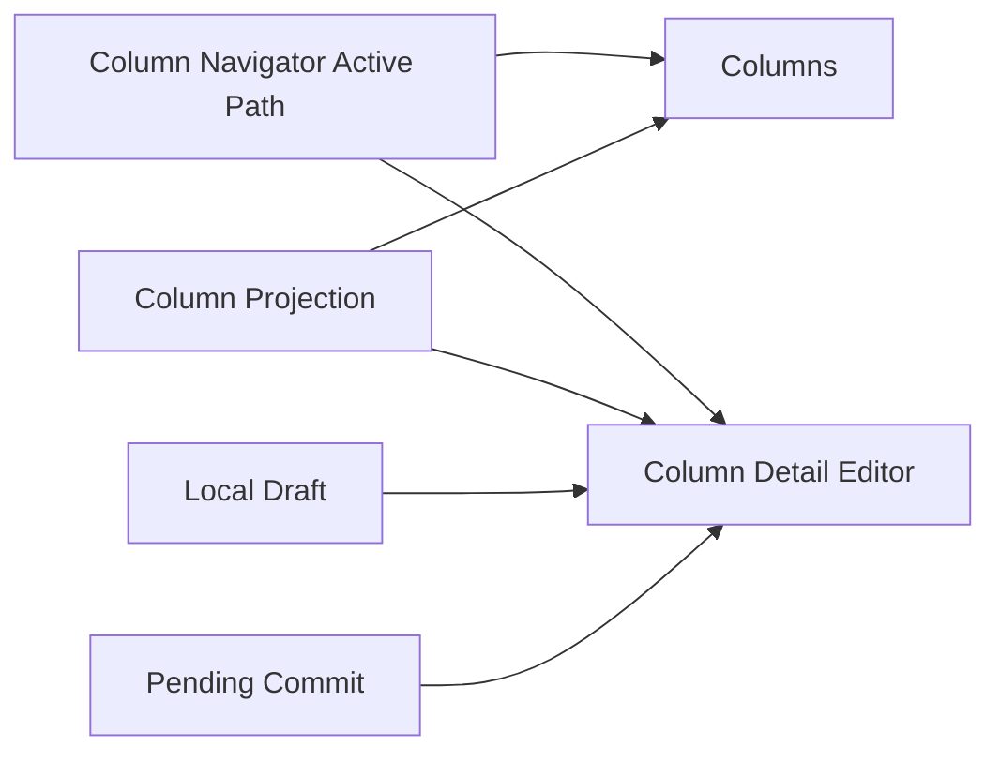

# Column Navigator Contract

The bottom feature area is named **Column Navigator** (`列导航器`). Its
horizontal column area is the **Column Rail** (`列轨道`), and its right-side
Monaco editing surface is the **Column Detail Editor** (`列详情编辑器`).
The **Column Navigator Active Path** is the single path authority shared by
the rail, detail editor, history, and keyboard navigation. The internal
controller is the **Column Navigator Controller**.

The shared application bottom bar is outside this product area: it renders
only the regular Tree Path from `activeTempModel.treePath`. It must not render
or route a second breadcrumb, Back/Forward history, or path selection through
the Column Navigator Active Path.

This document covers only the `Column Navigator` product area and its
underlying `Column Navigator` lifecycle domain:

- Column Navigator constraints
- Column Navigator data flow
- Relationships among entities directly related to the column navigator

## Core Entities

### Column Navigator Active Path

The single canonical path currently selected in the Column Navigator. Every
visible column, selected item, highlighted item, detail-editor target, and
Column Navigator history entry is derived from this path.

### Column Navigator Surface

A single Column Rail column or Column Detail Editor surface.

### Column

A fixed-width DOM column that displays the direct children of one object or
array path. Columns are projections, not independently navigable surfaces.

### Column Detail Editor

A `Column Detail Editor` surface that displays the selected path in a Monaco
value editor.

### Column Projection

A local column or value result read from the current snapshot and path.

### Local Draft

The local draft currently being edited in the Column Detail Editor.

### Pending Commit

The unfinished commit state for a Column Detail Editor on the same path.

## Core Entity Relationships



The relationships mean:

- `Column Navigator Active Path` is the only navigation authority.
- Columns are derived from path prefixes and each column's direct-child
  `Column Projection`.
- A selected leaf, non-empty container, or empty container binds the `Column Detail Editor` to that exact path.
- A column detail editor being edited holds a `Local Draft` and enters `Pending
  Commit` while its transaction is unfinished.

## Column Navigator Constraints

### Subdomain role

- The column navigator is a persistent Column Navigator at the bottom of GraphViewer.
- It is not a hover preview.
- It is not a second main-graph authority.
- It is not a new document authority.

### Column constraints

- The Column Navigator retains the complete active path; it does not truncate or
  compress to a fixed column count.
- A native horizontal rail contains fixed-width, non-shrinking columns.
- Each column owns an independent vertical scroll area. The rail does not use
  graph-canvas pan/zoom or wheel-to-pan translation.
- Empty objects and arrays remain containers but open directly in the content
  detail area and do not create an empty navigation column.
- Missing placeholder cells cannot open another column.

### Graph / content routing constraints

- Ordinary objects / arrays open as a column in the path rail.
- Ordinary scalars open in a `Column Detail Editor` by default.
- Empty containers `{}` / `[]` open as content without an empty navigation
  column.
- Non-empty containers keep their navigation column and expose their complete
  subtree text in the right-side Column Detail Editor.
- A miss placeholder cell cannot open another column.

### Projection constraints

- Column Navigator reads must bind to the current active snapshot.
- A column reads a Column Navigator projection rather than rebuilding the main graph.
- A column detail editor displays the local value bound to its path, not a new independent document.
- Its source text and semantic tokens are projections of the same path span in
  the active `DocumentSnapshot`; it must not create a second analysis or
  synthesize root-only highlighting.

### Editing constraints

- Columns and Column Detail Editor are different presentation surfaces, not two
  document or commit systems.
- The column rail has no graph-side editing runtime.
- A column detail editor's draft authority is its Monaco model.
- A column detail editor does not show an extra key input; by default it edits only the value.

### Lifecycle constraints

- During whole-document semantic reconstruction such as whole replace / import / language switch / initial example, reset the Column Navigator.
- Changes to snapshot, revision, renderConfig, or enableNest trigger the corresponding column refresh or cache invalidation.
- When a column is closed or removed from the chain, release its runtime and temporary state.

## Data Flow

### 1. Main-graph click opens the Column Navigator

```text
Graph click
  → reveal / editor synchronization
  → calculate path and target
  → read Column Projection
  → set Column Navigator Active Path
  → derive columns or Column Detail Editor
```

### 2. Drill down in a column

```text
Column Navigator column click
  → rebase path
  → reveal / editor synchronization
  → read the next Column Projection
  → replace descendant columns
```

### 3. Edit in a column detail editor

```text
Monaco local draft
  → column detail editor blur / change commit
  → Pending Commit
  → reuse the existing graph edit / planner / commit main path
  → main document update
  → Column Navigator source/token projection refresh
```

### 4. External main-document refresh affects the Column Navigator

```text
Main-document snapshot / revision changes
  → Column Navigator refresh decision
  → clean, unfocused Column Detail Editor may be updated from the external value
  → dirty or focused Column Detail Editor retains its local draft
```

### 5. Consecutive commits on the same path

```text
First commit unfinished
  → record Pending Commit
  → later input replaces the latest queued draft
  → submit the latest draft after the current commit finishes
```

## Column Navigator Rules

### Path rules

- The path from a main-graph click is the Column Navigator entry path.
- A path from a click within a column can be relative and must be rebased to the Column Navigator root path.
- Column Navigator reveal, editing, and subsequent column opening use the rebased path.

### Cache rules

- `pathValue` and `directChildren` are separate snapshot-bound reads. A path-value read supplies content and value metadata; a direct-children read supplies only the items for a rail column. Neither read rebuilds the main graph.
- Each cache is keyed by path within its current `documentKey + snapshotId` signature. A changed document key or snapshot id must not reuse either cached promise.
- `snapshotNotReady` is a distinct result, never an empty path value or an empty child list. The surface must remain loading or retain its last valid state until a ready result or an explicit reset; it must not present not-ready as an empty container.
- Reset, dispose, or a projection-context change clears both caches and invalidates pending results before a later result can land.

## Module Architecture

`apps/web/src/lib/components/graph-viewer/column-navigator/controller.ts` is the domain Module for `Column Navigator`. Its Interface handles path selection, sibling/parent/history navigation, content commits, size dragging, and projection-context synchronization; Column Navigator Active Path, derived columns, projection cache, stale invalidation, Pending Commit, and dispose are its Implementation.

`GraphViewRuntime.svelte` acts only as a View Runtime Adapter: it provides the current `DocumentSnapshot` binding and rendering and interaction dependencies, consumes Column Navigator state, and passes user intent to the Module. It does not maintain the Column Navigator refresh signature, cache key, request token, or editing queue.

Key seams inside the Module:

- Column Projection: all content reads and graph projections explicitly bind to the current `snapshotId`.
- DOM column rail: View Runtime provides the Treease host and editor lifecycle; Column Navigator owns no graph-canvas runtime for navigation columns.
- Commit Transaction: content edits write back to the main document through the
  existing graph edit / planner / commit main path; Column Navigator creates no new
  Document authority.

When the projection context changes, the Module invalidates the cache and rendering and refreshes existing columns; it discards stale open / refresh results using an internal Module token. Both `reset` and `dispose` release runtime, cache, and Pending Commit state.

`Pending Commit` is complete only after the corresponding main-document Commit Transaction's semantic state reaches its terminal state; text applied in Monaco is not a completion signal. This ensures the latest queued draft on the same path is planned against a new `DocumentSnapshot` rather than generating a second set of edits from an old snapshot.

### Interaction-consistency rules

- Column Navigator keyboard handlers are attached to the Column Navigator focus boundary only.
- Monaco retains native cursor, selection, and text-input behavior while it has
  focus.
- Reading in the Column Navigator must not disconnect editor reveal / graph highlight
  synchronization.

## Checklist

- Has the Column Navigator been incorrectly implemented as a new document authority?
- Is `activePath` the only source of navigation and detail-editor binding?
- Do columns derive from path prefixes and direct children?
- Do empty containers open as content without an empty navigation column?
- Is the complete path preserved through native horizontal scrolling?
- Are column and detail-editor vertical scrolling independent?
- Is a column detail editor's local draft incorrectly overwritten by an external refresh?
- Do consecutive commits on the same path retain and submit only the latest draft?
- Is a column item's path correctly rebased before drilling down?
