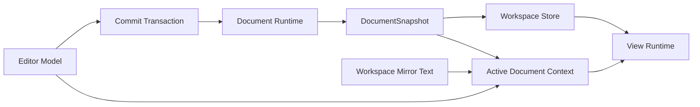

# Editor Data Flow Contract

This document explains Treease's primary-document path: where text authority resides, how commits advance, which state the frontend may retain, and which semantics may only come from the runtime.

It describes only the primary-document path:

- Core data-flow constraints
- Data flows for typical product scenarios
- Core entity relationships directly related to the data flow

It does not cover local implementation details, specific component decomposition, or helper names.

## Core Entities

Only entities directly related to the primary-document data flow are included.

### Editor Model

The draft text currently being edited and its local editing state.

### Commit Transaction

The commit unit for one primary-document write.

### Document Runtime

The runtime that advances primary-document state, produces events, and commits snapshots.

### DocumentSnapshot

A semantic unit of the primary document at a point in time.

### Workspace Store

Frontend workspace coordination state and visible bindings.

### Workspace Mirror Text

The latest visible text mirror retained by the frontend workspace when the current `Editor Model` cannot be read directly.

### Active Document Context

A read context that consolidates “where current text is read from” and “which snapshot current semantics bind to” at one entry point.

### View Runtime

The visible interaction and rendering state for Editor / Graph.

### View Runtime Operation Lifecycle

`View Runtime Operation Lifecycle` consolidates freshness, stale-result discard, resource cleanup, and UI landing for asynchronous Web operations. It consumes a stable target (`tabId`, `documentKey`, revision, language, resident Editor Model, and operation generation), but does not produce or interpret `DocumentSnapshot`.

## Core Entity Relationships



The relationships mean:

- `Editor Model` is the authority for current draft text.
- `Commit Transaction` is the only commit entry point for writes to the primary document.
- `DocumentSnapshot` is the authority for successful semantics.
- `Workspace Store` retains frontend bindings and shared state.
- `Workspace Mirror Text` is the text fallback source when the editor model is absent.
- `Active Document Context` consolidates text reads and snapshot binding at one read entry point.
- `View Runtime` only consumes this state for visible interactions.

## Core Constraints

### Text Authority

- Current text authority is first in `Editor Model`.
- Fall back to `Workspace Mirror Text` only when the model is unmounted or cannot be read directly.

### Commit Authority

- Writes to the primary document must pass through `Commit Transaction`.
- No other path may silently advance authoritative document state.

### Semantic Authority

The semantics of `DocumentSnapshot`, `SnapshotReady`, `ParseFailed`, and clear are defined exclusively by the [Document Runtime Contract](./document-runtime.md). This document only binds runtime terminal states to `Workspace Store` for `View Runtime` to consume.

### Binding Authority

- Frontend-visible `snapshotId` bindings are in `Workspace Store`.
- The frontend does not generate or define the semantics of `snapshotId`.

### View Runtime operation lifecycle

- `src/lib/guards/view-runtime-operation.ts` uses `FreshnessScope` to unify multi-stage freshness checks for one asynchronous operation.
- **Document freshness** permits a result to land in its captured Tab only when that Tab, its generation, resident model, document identity, revision, and language still match. Switching Tabs does not make this check fail.
- **Visible freshness** is stricter: it additionally requires the target Tab and model to be the installed active context. Only visible-fresh results may affect the active Editor, Graph scene, diagnostics, cursor, or toast.
- Each operation performs stale cleanup at most once. The Tab operation owner cancels its `DocumentJob`; a Graph render attachment owns only its batch consumer and may detach without cancelling that job.
- A bounded stream replay is not a graph baseline. A late attachment without complete replay waits for the authoritative terminal snapshot and then performs the canonical render.
- The Rust `Document Runtime` still owns authoritative freshness and the semantics of `DocumentSnapshot`, `SnapshotReady`, `ParseFailed`, and snapshot-bound reads; the Web operation lifecycle only decides whether an old visible result may land.
- Synchronous readiness / request correlation may retain a local requestId, but must no longer own freshness for asynchronous stale cleanup or UI landing.
- `FreshnessScope` may still serve local one-shot queries that own no resources and have no terminal UI landing, such as local hover, search, or immediate value parsing. They do not create parallel operation authority or replace the View Runtime operation lifecycle.

## Product Scenario Data Flows

### 1. User directly edits the primary document

```text
User input
  → Editor Model
  → Commit Transaction
  → Document Runtime
  → DocumentSnapshot
  → Workspace Store
  → View Runtime
```

### 2. Programmatic whole-document replacement

```text
Program action (import / preset / language switch / replace)
  → Workspace Store / Editor Model
  → Commit Transaction
  → Document Runtime
  → DocumentSnapshot
  → View Runtime
```

### 3. Primary-document semantic read

```text
Product read request
  → Active Document Context
  → Snapshot-bound Read
  → Document Runtime
  → DocumentSnapshot result
  → View Runtime
```

### 4. Runtime result enters visible state

```text
Commit completes
  → Document Runtime
  → Runtime result (see Document Runtime Contract)
  → Workspace Store / View Runtime
```

When the runtime returns a parse-failed terminal state, `View Runtime` may trigger transient JSON block analysis from the current `Editor Model`:

```text
Editor Model
  → cursor position
  → find JSON block
  → transient DocumentJob for the block
  → local graph / semantic tokens
  → View Runtime
```

This path serves only local visible experiences, such as a JSON block graph, source-editor semantic tokens, and location feedback. It must not bind as the primary document's successful `snapshotId`, serve as the successful baseline for graph / search / planner / Column Navigator, or bypass `Commit Transaction` to advance primary-document authority.

### 5. Blank / whitespace close

```text
Empty-text commit
  → Commit Transaction
  → Document Runtime
  → Runtime result (see Document Runtime Contract)
  → Workspace Store
  → View Runtime
```

### 6. First mutation of a shared draft

A shared draft enters the same primary-document path; share promotion never becomes a second document-write path. Direct Monaco input changes `Editor Model` synchronously and starts promotion beside the existing `Commit Transaction`. A command that can wait promotes only after quota, result, freshness, and no-op checks, immediately before its canonical `Editor Model` mutation.

```text
Direct input
  → Editor Model
  ├→ Commit Transaction → Document Runtime
  └→ Share workspace promotion → workspace/session persistence only

Command mutation
  → quota / planner / conversion / freshness
  → Share workspace promotion
  → Editor Model
  → Commit Transaction
  → Document Runtime
```

`Commit Transaction` does not depend on share lifecycle or `WorkspaceHost`. See [Share Workspace Contract](./share-workspace.md) for promotion and persistence authority.

### 7. AI and structure-generation previews

AI yq suggestion and structure-definition generation are asynchronous, read-only requests over a captured active-document context. They may create a right-pane preview but never mutate the source document or advance `Document Runtime` authority.

```text
captured tab / documentKey / revision / language / source text
  → AI suggestion or structure-generation request
  → local preview preparation (when required)
  → freshness check against the captured context
  → right-pane preview or captured-context error
```

Before any success, error, busy-state completion, toast, or viewer-preview landing after an `await`, the operation must verify the captured document context with the View Runtime operation lifecycle. A result from a replaced document, changed revision/language, closed tab, or superseded request is stale and must be discarded; it must not alter the currently visible document or preview.

## Primary-Document Data-Flow Checklist

- Does current text land in `Editor Model` first?
- Do all primary-document writes pass through `Commit Transaction`?
- Do all structured semantics bind a `DocumentSnapshot`?
- Does transient JSON block analysis serve only local views rather than impersonating successful primary-document semantics?
- Does `Workspace Store` only coordinate and bind, rather than reconstruct document semantics?
- Does `View Runtime` only consume state rather than silently becoming an authority?
- Do AI and structure-generation callbacks verify their captured document context before they land UI state?
