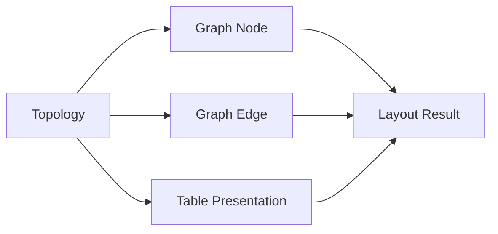

# Layout Contract

This document constrains layout correctness. It answers four questions:

1. Which structures produce independent nodes
2. How different node types must appear
3. How generated nodes calculate positions and connections
4. Which results must agree across full builds, streaming, and changed regions, and which results immediately indicate an incorrect layout

## Inputs and Outputs

### Inputs

- Topology: parent-child relationships, structural type, visibility, and inline/expanded classification
- Node intrinsic size: each node's width, height, and internal row height
- Spacing configuration: `h_gap`, `v_gap`
- Table row / cell anchors: semantic anchors for table rows and structural values

### Outputs

- The visible set of graph nodes
- Geometry for every node: `x / y / width / height`
- Start and end anchor positions for every edge
- Row / cell geometry for tables

## Core Entities

### Topology

Structural semantics deciding parent, child, independent visibility, and inline-value presence.

### Graph Node

An independently visible node to place during layout.

### Graph Edge

A connection expressing parent-child structural semantics.

### Table Presentation

The internal presentation of `Sequence` / `Object` in table reading form.

### Layout Result

The nodes, edges, and table geometry produced by layout.

## Core Entity Relationships

## I. Node Classification

### Mapping Tree Structures to Graph Structures

| Tree structure                       | Default graph semantics                        |
| ------------------------------------ | ---------------------------------------------- |
| `Mapping`                            | `Object`                                       |
| `Sequence`                           | `Headerless Table` or `Header Table`           |
| Other (`Scalar`, `Alias`, and so on) | `Scalar` or an inline value in its parent node |

### Independent-Node Rules

- `Mapping` produces an `Object` node by default.
- `Sequence` produces a `Table` node by default, represented as either a `Headerless Table` or `Header Table`.
- An empty `Mapping` does not produce an `Object` node; it degrades to a `Scalar` node.
- An empty `Sequence` does not produce a `Table` node; it degrades to a `Scalar` node.
- An ordinary scalar is not independently promoted to a primary-graph node by default; it is displayed inline as a value in its parent.
- A header-table row always belongs to the parent `Table`'s internal presentation and never becomes an independent primary-graph node.
- A headerless-table row is likewise not an independent primary-graph node.
- A nested container cell inside a row may be an entry point for further reading / expansion, but it is not a primary-graph row node.

### Sequence Classification Rules

Whether a `Sequence` appears as a `Header Table` depends only on its first item under the current rules:

- An empty sequence is not a `Header Table`; treat it as a `Headerless Table`.
- If the first item is a `Mapping` and none of its direct values is a `Mapping` or `Sequence`, treat the entire sequence as a `Header Table`.
- If the first item is a `Mapping` with a direct `Mapping` or `Sequence` value, treat the entire sequence as a `Headerless Table`.
- If the first item is not a `Mapping`, treat the entire sequence as a `Headerless Table`.

Therefore:

- `Header Table` classification is neither “whether most items are objects” nor “whether every item has the same shape.”
- Once the first item qualifies for a `Header Table`, the whole sequence remains a `Header Table` even when later items are not `Mapping`; those items go in the fallback `value` column.
- A first-item `Mapping` with a direct object or array value remains a `Headerless Table`; nested structure is not projected into header columns.
- Once the first item is not a `Mapping`, the whole sequence remains a `Headerless Table` even if a later item is a `Mapping`; it is not promoted to a header table.

### Consistency Requirements for Classification

- Full builds, streaming, and changed regions must make the same decision about whether a structure is an independent node.
- The same structure must not be inline on one execution path and promoted to an independent node on another.
- A table row or local value must not be temporarily promoted to a primary-graph node merely to simplify local relayout.

## II. Node Presentation

### `Scalar`

- A single `Scalar` node is always one row; it does not split out an additional key column.
- Its key area is empty and its value area carries all visible text.
- Empty `Mapping`, empty `Sequence`, and ordinary scalars follow the same one-row style after entering this branch.
- A single `Scalar`'s width comes from its value text; its height uses the one-row height.

### `Object`

- The basic reading unit of an `Object` is a `key/value` row.
- Each field must visually preserve a distinction between its field-name area and field-value area.
- When an object value is a structural value that can expand further, it first appears as the current row's value semantics, then reaches deeper nodes through an edge or later expansion.

### Empty-Container Degradation

- An empty `Mapping` degrades to one `Scalar`, showing an empty-object summary value rather than an empty `Object` box.
- An empty `Sequence` degrades to one `Scalar`, showing an empty-sequence summary value rather than an empty `Table` box.
- This applies consistently to full builds, streaming, and changed regions. No path may draw an empty container as a scalar while another draws an empty object / table.

### `Headerless Table`

- It is used when the first item is not a `Mapping`, or when the first-item `Mapping` has a direct object or array value.
- Its reading semantics resemble an object node's `key/value` rows, but the key area displays the sequence index.
- Every row is exactly two columns: index + value.
- A row is not an independent primary-graph row node. A non-empty `Mapping` or `Sequence` item is nevertheless a structural value that Core may expose as an expandable child at that sequence index; its edge anchors at that row.
- It always exposes its full body height and does not use a vertical scrollbar or virtual row window.

### `Header Table`

- It is used for a sequence whose first item is a `Mapping` whose direct values contain no object or array.
- It uses header + body table semantics rather than object-style two-column rows.
- Its columns are the stable union of visible keys across all mapping items.
- Column 0 is always the index column.
- If the sequence contains a non-`Mapping` item, or every mapping has no visible key, append a fallback `value` column for those values.
- A row is an internal table presentation unit and is not independently promoted to a primary-graph node.

### `Header Table` Fallback `value` Column

- A fallback `value` column is required when any sequence item is not a `Mapping`.
- It is also required when all `Mapping` items have no visible key.
- It carries an entire item value that cannot project into the header-key set.

### Virtual Table

`virtual table` is not a new node type. It is how a `Header Table` appears when its body height exceeds the visible height. A `Headerless Table` is never virtualized.

It is triggered when:

- `table.total_height > table.view_height`
- Equivalently, table-body content height exceeds the currently allowed viewport height.
- For a `Header Table`, `view_height` is capped by `table_max_height`, so large tables enter this branch.

Presentation requirements:

- The semantic node remains the same `Table`; virtualization never splits it into multiple nodes.
- When present, the header remains the table's header region; the body scrolls, not the table's semantic identity.
- Only rows near the current visible body window render, rather than materializing all rows at once.
- Row index, path, and anchor semantics do not change; virtualization changes only which rows currently render in the viewport.
- External hit tests, reveal, highlights, and edge anchors must still use real row semantics; semantic location must not disappear because a row is not rendered.

## III. Geometry Rules

### X-Axis Rules

- The root node begins at `x = 0`.
- A depth's column coordinate equals the maximum right boundary of all nodes at the previous depth plus `h_gap`.
- Nodes at the same depth therefore share one column coordinate; each parent must not derive its own child column.
- An incremental update affecting only a local subtree may recompute just the affected region, but its result must still satisfy same-depth shared-column semantics.

### Y-Axis Rules

- The first node at a depth takes its `y` from its parent's semantic starting point.
- Every later node at that depth must satisfy `max(parent y, bottom of content already placed at that depth + v_gap)`.
- Thus same-depth nodes preserve reading order and do not overlap.
- Changed-region relayout may move the affected region and the necessary propagation range, but must not rewrite the established vertical order of stable regions without reason.

### Edge Rules

- An edge starts near the semantic outgoing position on the parent's right boundary.
- An edge ends near the semantic incoming position on the child's left boundary.
- The start `y` binds to the value position in the parent associated with that child, not the parent geometry center.
- The end `y` binds to the child's first visible semantic entry point, not the child geometry center.
- For a table parent, the edge's vertical anchor follows the real position of the corresponding row. After table growth or local reordering, the edge must not remain attached to the old row.
- Outgoing edges from one node preserve vertical order: when one start anchor is above another, its end anchor must not be below the other's end anchor. Reversing that order makes the edges cross.
- Core owns edge anchor and Bézier geometry. Web may filter and draw edges, but it must not recompute layout geometry from rendered node boxes.
- Core encodes table presentation in the protocol: `header_height > 0` is a `Header Table`, while `header_height == 0` is a `Headerless Table`. Core alone determines `view_height` and virtual-table eligibility; Web consumes those fields and must not reclassify or virtualize a headerless table.

## IV. Consistency Constraints

### Full-Build / Streaming Consistency

- Full builds and streaming must converge to the same node-generation and layout result.
- Chunks may publish partial increments, but after close the result must not conflict with final full-build layout semantics.

### Changed-Region Consistency

- Changed-region relayout should affect only the necessary area where possible.
- After a local update, unaffected regions must not change column, order, or position without reason.
- A growing table may expand locally, but must not turn the entire graph into a newly rearranged graph on every update.

### Geometry Consistency

- Nodes at the same depth share the same column semantics.
- Nodes at the same depth do not overlap.
- Edges bind to current real semantic positions and must not remain at obsolete geometry.
- Edges from the same source preserve start-to-end vertical order and do not cross.
- A virtual table's visible window may change, but its node identity, row-index semantics, and reveal / anchor semantics must not change.
- Empty `Mapping` and `Sequence` must keep single-scalar geometry on every build path, never object/table geometry on some paths.

## V. Explicit Errors

Any of these results means the layout is wrong:

- Nodes at the same depth appear in different columns although they should share a same-depth column.
- A depth's column coordinate does not equal “maximum right boundary of the previous depth + `h_gap`.”
- Same-depth nodes overlap vertically, or a later node crosses above the previous node's bottom.
- An edge attaches to a parent or child geometry center rather than the corresponding semantic position.
- After table growth, row-height changes, or local reordering, an edge remains attached to an old row.
- Two outgoing edges reverse their vertical endpoint order and cross.
- Full build and streaming give the same structure different node visibility or final layout.
- Changed-region relayout rewrites an established region's order or column alignment without necessity.
- The same sequence is a `Headerless Table` in one build and a `Header Table` on another path.
- A table has entered the scroll / virtual branch, but reveal, hit testing, or row anchors still use geometry from an old visible window.
- An empty `Mapping` or `Sequence` is drawn as an empty object / table rather than one scalar.

## Checklist

- Does this change alter which structures become independent nodes?
- Does it still make same-depth nodes share a column?
- Does it still keep same-depth nodes non-overlapping and parents before children?
- Do resulting edges still bind real semantic positions?
- Do full builds, streaming, and changed regions still converge?
