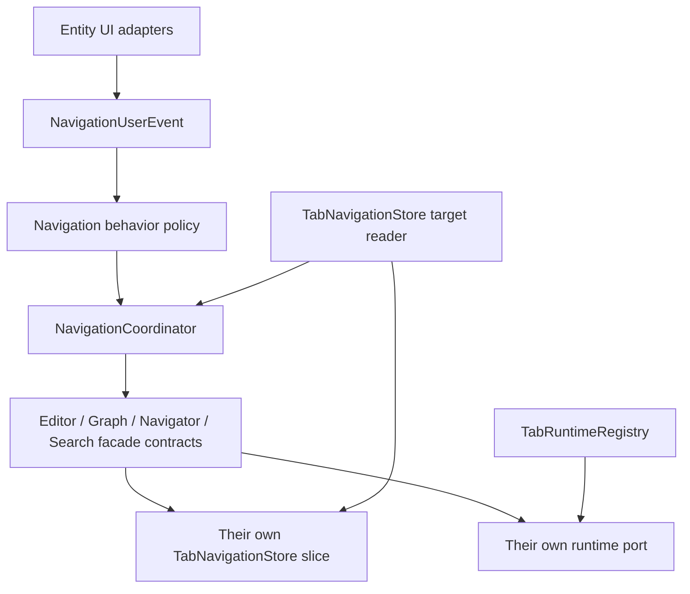

# Navigation Contract

## Scope and terms

This contract governs navigation among the Editor, Graph, Column Navigator, and
Search in one Web workspace. Navigation means locating one semantic path in the
current document and projecting that location into one or more of these surfaces.
It does not define document parsing, editing, Graph layout, or Column Navigator
projection semantics; those remain owned by their respective contracts.

A `NavigationTarget` identifies the exact recipient of an interaction:
`workspaceId + tabId + documentKey + generation + revision`. A `NavigationPath`
is the semantic path within that target. A target is captured when the fact occurs;
it is never inferred later from whichever Tab happens to be active.

## Modules and dependency direction



- UI adapters publish user facts and implement entity-local runtime ports. They
  do not call other entity adapters as a navigation command.
- The behavior policy maps every user fact to exactly one behavior. The
  coordinator creates transactions, orders cross-entity work, and aggregates
  results; it does not read or mutate an entity's internal state.
- Facades own state and runtime rules for exactly one entity. A facade receives
  a write capability for only its own Tab-local slice, never the general store.
- The store owns navigation target validity and Tab-local state topology. The
  registry owns disposable runtime bindings, which are intentionally outside
  persisted state. The active-Tab projection is read-only.
- Dependencies flow from adapter to contract to coordinator to facade to local
  port/state. No entity may depend on another entity's implementation or write
  its slice directly.

## State model and authority

```text
TabNavigationState
  tabsById[tabId]
    NavigationTarget { workspaceId, tabId, documentKey, generation, revision }
    editorState    { selection, lastNavigationSelection }
    graphState     { entity-local graph navigation state }
    navigatorState { activePath, history, historyIndex, columnsMaterialized, expanded }
    searchState    { previewId }
  tabOrder
  activeTabId

TabRuntimeRegistry
  tabId + binding key -> disposable runtime binding (not persisted)
```

- `TabNavigationStore` is the authority for the navigation target and all
  Tab-local navigation slices. A slice is immutable to consumers and may be
  changed only through its owner facade.
- A document replacement increments `generation` and recreates all slices. A
  revision update changes target identity without changing the slices. Closing a
  Tab removes its target and invalidates its bindings.
- `NavigatorNavigationState.activePath` and its history are the navigation
  authority for the cross-entity path projection. Column-derived surfaces remain
  projections; the detailed Column Navigator contract defines their local rules.
- Editor selection checkpoints are Editor state. Graph preview baselines and
  viewport-transition ownership are Graph state. Search owns only preview UI
  identity, not Graph viewport state.
- Active Tab is a presentation selection, not a fallback navigation target.
  Background Tabs may receive current logical state but must not scroll, focus,
  or otherwise steal visible interaction.

## Event and behavior contract

| User fact | Stable behavior |
| --- | --- |
| Editor selection, Graph cell, or Column Navigator column selection | `locate` when complete navigation is disabled; otherwise `navigate` |
| Tree Path selection or Search commit | `navigate` |
| Search preview | Graph highlight preview, or viewport preview when complete navigation is enabled |
| Search cancellation | Cancel the matching preview and clear its Search identity |
| Graph viewport gesture | Release only preview viewport-restore ownership |
| Graph readiness | Replay the latest deferred Graph-only command for that target |
| Editor edit/scroll, Tab activation, or state restoration | No cross-entity navigation |

`locate` updates Graph highlighting and Navigator path/history without forcing
editor reveal or Column materialization. `navigate` first commits the Navigator
path/history and then performs the asynchronous Editor and Graph work. This
ordering makes the path visible as one coherent state even if a scene remounts.

Search preview is temporary. Replacing or committing it clears the matching
identity; cancelling restores only the preview baseline owned by that preview.
A manual Graph viewport gesture revokes viewport restore only, leaving selection
restore available when applicable.

## Data flow and result semantics

```text
captured user fact
  → behavior policy
  → fresh transaction for the captured Tab
  → Navigator path/history commit (for navigate)
  → entity facade operations
  → target/freshness check
  → aggregated NavigationDispatchResult
```

Each operation reports exactly one result: `applied`, `no-op`, `deferred`,
`stale`, `cancelled`, `closed`, or `failed`. `deferred` means the Graph scene is
not interactive and has retained the latest applicable Graph command; it is not
a successful render. `stale` and `closed` mean that no write may land. `failed`
preserves the error for the owning boundary to surface or handle; it must not be
converted into an unrelated success or an implicit fallback.

## Freshness, lifecycle, and safety invariants

- Navigation is latest-wins per Tab. Starting a newer navigation in one Tab
  invalidates older transactions in that Tab only; it never cancels another Tab.
- Every asynchronous operation captures its target before yielding and checks
  both transaction freshness and target validity before every runtime or state
  write. It must not re-resolve the active Tab at completion time.
- Replaced or closed targets reject late results. Their runtime bindings are
  disposed, and a disposed binding cannot write into a new document generation.
- Programmatic Editor selection, restore, binding, edit, scroll, and unknown
  causes do not republish an Editor-selection navigation fact. Only a confirmed
  user selection may start that loop.
- Navigator path and history are applied atomically by its runtime port and
  committed to the Navigator slice only after that port accepts the command.
  External path materialization must not publish a new user breadcrumb fact.
- A Graph that is not interactive retains at most the latest deferred Graph
  command for its captured target. Readiness replays it only when that target is
  still current.
- Preview baseline capture, restore, cancellation, and disposal are target-bound
  and idempotent. A preview from one Tab or document generation cannot restore
  another Tab's selection or viewport.
- No navigation path may create a second document authority, bypass the
  canonical Editor/Graph edit path, or use navigation state as persisted
  document semantics.

## Stable user-facing behavior

- Selecting a field from text, the Graph, a Navigator column, a Tree Path, or a
  committed search result refers to the same semantic path in the same document.
- Complete navigation reveals the matching editor range, highlights and reveals
  the Graph target, and opens the relevant Navigator path. Lightweight location
  updates the location without forcing those expensive presentation changes.
- Search hover/preview is reversible. Cancel returns the prior preview-owned
  view; commit makes the selected path the normal navigation state.
- Switching, closing, or replacing Tabs does not cause delayed navigation from
  an old document to appear in the new or visible Tab.
- Navigation caused by the application does not masquerade as a new user action
  or create feedback loops.

## Review checklist

- Is the target captured at the user-event boundary and checked after every
  asynchronous boundary?
- Does the changed module depend only on its allowed contract and write only its
  own slice?
- Is each new user fact mapped by the behavior policy, including its no-op case?
- Are close, replacement, stale completion, preview cancellation, and Graph
  readiness defined without a fallback to active-Tab state?
- Does the change preserve the user-visible outcomes above for foreground and
  background Tabs?
