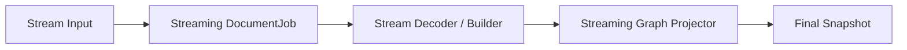

# Streaming Contract

This document covers only the streaming path:

- Streaming data flow
- Streaming implementation constraints
- Relationships among entities directly related to streaming

## Core Entities

### Stream Input

Input fragments from in-memory chunks or a `ReadableStream`.

### Streaming DocumentJob

The `DocumentJob` that advances a streaming input.

### Stream Decoder / Builder

The entity that turns chunks into structural events and maintains intermediate structural semantics.

### Streaming Graph Projector

The entity that continuously produces graph deltas while chunks arrive.

### Final Snapshot

The final authoritative snapshot after close.

## Core Entity Relationships



## Data Flow

### True streaming for same-language JSON

```text
File.stream / chunk source
  → job start (fixed parser.enableNest / formatting.smart / formatSourceOnClose)
  → Streaming DocumentJob
  → advanceDocumentJob(chunk)
  → Stream Decoder / Builder (enableNest starts affecting decoder / source rewrite / path here)
  → Streaming Graph Projector
  → ProjectionDelta
  → close (when smart + formatSourceOnClose is enabled, the final formatted sourceText is produced here)
  → Final Snapshot
```

### Pseudo-streaming for non-JSON

```text
chunk source
  → Streaming DocumentJob
  → cache source
  → close
  → decode / materialize
  → Final Snapshot
```

### `ApplyEdits`

```text
edits + base snapshot
  → job start
  → materialize with base
  → Final Snapshot
```

It reuses the unified job API but is not currently parser-level true streaming.

## Timing

### `enable nest parse`

`enableNest` enters the parser settings at job start and takes effect when the first chunk initializes stream state.

```text
job start
  → StreamState::for_language(..., settings)
  → chunk feed
  → decoder.feed / take_source_rewrites
  → source_doc.commit_events
  → builder.push
  → projector.update
  → ProjectionDelta
```

Its position means:

- It is part of chunk-time semantics, not a correction added after close.
- It affects the structural events produced by the decoder, source rewrites, path semantics, and incremental graph projection.
- Close only consolidates these active nested semantics into the final snapshot / sourceText.

### `enable auto format`

Here, auto format means `formatting.smart = true` and `formatSourceOnClose = true`.

```text
chunk feed
  → decoder / builder / projector continue according to the original streaming semantics
  → close
  → builder.take_document
  → format_json_document_with_spans
  → write back the final formatted sourceText
  → Final Snapshot
```

Its position means:

- It does not participate in producing `ProjectionDelta` during chunk processing.
- It runs only at close finalization to produce the final authoritative `sourceText`.
- If nested expansion has rewritten the source, first consolidate a canonical rewritten source, then decide at close whether to perform final smart formatting.

## Implementation Constraints

### True-streaming constraints

- Same-language JSON file imports must produce real `ProjectionDelta` before close.
- Graph semantics produced during chunk processing are not a “fake preview.”
- After close, the path must return to the final state defined by the [Document Runtime Contract](./document-runtime.md).

### Pseudo-streaming constraints

- Non-JSON chunk input is transport chunking only.
- It must not masquerade as completed graph construction before close.

### Clear / parse-failed constraints

Blank / whitespace and parse-failed states at close must be handled by the
[Document Runtime Contract](./document-runtime.md); streaming must not define parallel terminal states or present an old graph as the current successful result.

After parse failure, transient JSON block analysis based on the current `Editor Model` is allowed, but it can serve only a local View Runtime; it must not be written as the main document's `SnapshotReady`.

### Nested JSON constraints

- When enableNest is enabled, chunk-time paths, source rewrites, ProjectionDelta, post-close sourceText, and subsequent snapshot-bound reads must share the same nested-path semantics.

### Auto-format constraints

- Smart format may rewrite final `sourceText` only during close finalization.
- `ProjectionDelta` already published during chunk processing must not rely on close-time formatting to “correct” it.
- The final `sourceText` returned after close must use the same canonical source as the final snapshot.

### Root scalar replace constraint

- At close finalization, a root scalar whole replace must clear stale root-graph remnants.

## Checklist

- Is this scenario true streaming, pseudo-streaming, or a non-streaming commit?
- Is producing `ProjectionDelta` allowed before close?
- Does the path return after close to the final state defined by the Document Runtime Contract?
- Are parse-failed / blank-clear states handled by the Document Runtime Contract?
- Is JSON block analysis after parse failure an independent transient job rather than an old-graph fallback?
- Does anything rely on close to “correct” graph semantics that were published incorrectly earlier?
