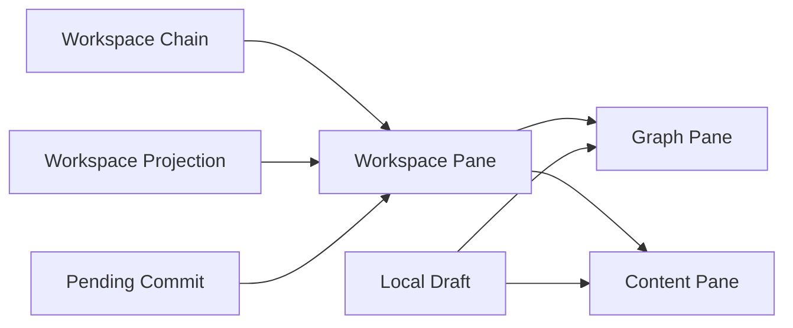

# Subgraph Workspace Contract

This document covers only the `Subgraph Workspace` product subdomain:

- Subgraph workspace constraints
- Subgraph workspace data flow
- Relationships among entities directly related to the subgraph workspace

## Core Entities

### Workspace Chain

The chain of panes currently open in the bottom workspace.

### Workspace Pane

A single reading / editing unit in the workspace.

### Graph Pane

A pane that displays a structured path as a graph canvas.

### Content Pane

A pane that displays a scalar path in a Monaco value editor.

### Workspace Projection

A local graph or value result read from the current snapshot and path.

### Local Draft

The local draft currently being edited in a content pane or graph pane.

### Pending Commit

The unfinished commit state for a pane on the same path.

## Core Entity Relationships



The relationships mean:

- `Workspace Chain` manages the currently open pane chain.
- Each `Workspace Pane` is either a `Graph Pane` or a `Content Pane`.
- Pane content comes from a `Workspace Projection`.
- A pane being edited holds a `Local Draft`.
- A pane with an in-flight commit enters `Pending Commit`.

## Subgraph Workspace Constraints

### Subdomain role

- The subgraph workspace is a persistent workspace at the bottom of GraphViewer.
- It is not a hover preview.
- It is not a second main-graph authority.
- It is not a new document authority.

### Pane constraints

- The workspace retains at most three visible panes.
- As users drill down a path, the pane chain remains organized by its ancestor chain and current branch.
- When there are more than three panes, do not compress the chain semantics; show the full chain through horizontal scrolling while displaying at most three panes at once.
- Pane titles express the current path without adding a separate breadcrumb UI.

### Graph / content routing constraints

- Ordinary objects / arrays open in a `Graph Pane` by default.
- Ordinary scalars open in a `Content Pane` by default.
- Empty containers `{}` / `[]` are an exception: they currently open as single-cell content in a `Content Pane`.
- A miss placeholder cell cannot open another pane.

### Projection constraints

- Workspace reads must bind to the current active snapshot.
- A graph pane reads a workspace projection rather than rebuilding the main graph.
- A content pane displays the local value bound to its path, not a new independent document.

### Editing constraints

- Graph and content panes are different entry points, not two commit systems.
- A graph pane's draft authority is its graph-side editing runtime.
- A content pane's draft authority is its own Monaco model.
- A content pane does not show an extra key input; by default it edits only the value.

### Lifecycle constraints

- During whole-document semantic reconstruction such as whole replace / import / language switch / initial example, reset the workspace.
- Changes to snapshot, revision, renderConfig, or enableNest trigger the corresponding pane refresh or cache invalidation.
- When a pane is closed or removed from the chain, release its runtime and temporary state.

## Data Flow

### 1. Main-graph click opens the workspace

```text
Graph click
  → reveal / editor synchronization
  → calculate path and target
  → read Workspace Projection
  → create a Graph Pane or Content Pane
  → update Workspace Chain
```

### 2. Drill down in a graph pane

```text
Workspace graph pane click
  → rebase path
  → reveal / editor synchronization
  → read the next Workspace Projection
  → expand another pane on the right
```

### 3. Edit in a content pane

```text
Monaco local draft
  → content pane blur / change commit
  → Pending Commit
  → reuse the existing graph edit / planner / commit main path
  → main document update
  → workspace refresh
```

### 4. External main-document refresh affects the workspace

```text
Main-document snapshot / revision changes
  → workspace refresh decision
  → clean, unfocused content panes may be updated from the external value
  → dirty or focused content panes retain their local draft
```

### 5. Consecutive commits on the same path

```text
First commit unfinished
  → record Pending Commit
  → later input replaces the latest queued draft
  → submit the latest draft after the current commit finishes
```

## Workspace-Specific Rules

### Path rules

- The path from a main-graph click is the workspace entry path.
- A path from a click within a graph pane can be relative and must be rebased to the workspace root path.
- Workspace reveal, editing, and subsequent pane opening use the rebased path.

### Cache rules

- The graph cache stores projection results only for the same `documentKey + snapshotId + revision + renderConfig + enableNest` combination.
- When that combination changes, invalidate the cache as a whole.

## Module Architecture

`apps/web/src/lib/components/graph-viewer/workspace/controller.ts` is the domain Module for `Subgraph Workspace`. Its Interface handles only path opening, pane closing, content commits, host mounting, size dragging, and projection-context synchronization; pane chain, visible panes, projection cache, stale invalidation, Pending Commit, runtime map, and dispose are its Implementation.

`GraphViewRuntime.svelte` acts only as a View Runtime Adapter: it provides the current `DocumentSnapshot` binding and rendering and interaction dependencies, consumes Workspace state, and passes user intent to the Module. It does not maintain the Workspace refresh signature, cache key, request token, or editing queue.

Key seams inside the Module:

- Workspace Projection: all content reads and graph projections explicitly bind to the current `snapshotId`.
- Graph Runtime: View Runtime provides Leafer constructors, pointer binding, and editor lifecycle; Workspace creates, retains, and releases each pane runtime.
- Commit Transaction: edits in Graph Pane and Content Pane both write back to the main document through the existing graph edit / planner / commit main path; Workspace creates no new Document authority.

When the projection context changes, the Module invalidates the cache and rendering and refreshes existing panes; it discards stale open / refresh results using an internal Module token. Both `reset` and `dispose` release runtime, cache, and Pending Commit state.

`Pending Commit` is complete only after the corresponding main-document Commit Transaction's semantic state reaches its terminal state; text applied in Monaco is not a completion signal. This ensures the latest queued draft on the same path is planned against a new `DocumentSnapshot` rather than generating a second set of edits from an old snapshot.

### Interaction-consistency rules

- Graph-pane canvas interaction should align as closely as possible with the main graph.
- Default zoom, dragging, and panning bounds should preserve the same semantics.
- Reading in the workspace must not disconnect editor reveal / graph highlight synchronization.

## Checklist

- Has the workspace been incorrectly implemented as a new document authority?
- Does pane routing still follow the graph / content product rules?
- Do empty containers still use a content pane?
- Does the pane chain still follow the rule of at most three visible columns with the full chain retained through horizontal scrolling?
- When there are more than three panes, is the full chain preserved through horizontal scrolling?
- Is a content pane's local draft incorrectly overwritten by an external refresh?
- Do consecutive commits on the same path retain and submit only the latest draft?
- Is a graph pane's path correctly rebased before drilling down?
