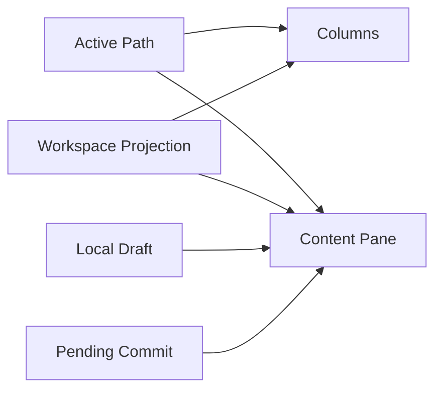

# Column Navigator Contract

The bottom feature area is named **Column Navigator** (`列导航器`), and its
right-side editing surface is **Column Detail Editor** (`列详情编辑器`).
`Subgraph Workspace` remains the implementation and lifecycle term for the
underlying persistent region; it is not the user-facing name of the feature.

This document covers only the `Column Navigator` product area and its
underlying `Subgraph Workspace` lifecycle domain:

- Subgraph workspace constraints
- Subgraph workspace data flow
- Relationships among entities directly related to the subgraph workspace

## Core Entities

### Active Path

The single canonical path currently selected in the bottom workspace. Every
visible column, selected item, highlighted item, detail-editor target, and
workspace history entry is derived from this path.

### Workspace Surface

A single column or content-detail reading/editing surface in the workspace.

### Column

A fixed-width DOM column that displays the direct children of one object or
array path. Columns are projections, not independently navigable panes.

### Content Pane

A `Column Detail Editor` surface that displays the selected path in a Monaco
value editor.

### Workspace Projection

A local column or value result read from the current snapshot and path.

### Local Draft

The local draft currently being edited in the content-detail surface.

### Pending Commit

The unfinished commit state for a pane on the same path.

## Core Entity Relationships



The relationships mean:

- `Active Path` is the only navigation authority.
- Columns are derived from path prefixes and each column's direct-child
  `Workspace Projection`.
- A selected leaf, non-empty container, or empty container binds the `Content
  Pane` to that exact path.
- A content pane being edited holds a `Local Draft` and enters `Pending
  Commit` while its transaction is unfinished.

## Subgraph Workspace Constraints

### Subdomain role

- The subgraph workspace is a persistent workspace at the bottom of GraphViewer.
- It is not a hover preview.
- It is not a second main-graph authority.
- It is not a new document authority.

### Column constraints

- The workspace retains the complete active path; it does not truncate or
  compress to a fixed column count.
- A native horizontal rail contains fixed-width, non-shrinking columns.
- Each column owns an independent vertical scroll area. The rail does not use
  graph-canvas pan/zoom or wheel-to-pan translation.
- Empty objects and arrays remain containers but open directly in the content
  detail area and do not create an empty navigation column.
- Missing placeholder cells cannot open another column.

### Graph / content routing constraints

- Ordinary objects / arrays open as a column in the path rail.
- Ordinary scalars open in a `Content Pane` by default.
- Empty containers `{}` / `[]` open as content without an empty navigation
  column.
- Non-empty containers keep their navigation column and expose their complete
  subtree text in the right-side content detail.
- A miss placeholder cell cannot open another pane.

### Projection constraints

- Workspace reads must bind to the current active snapshot.
- A column reads a workspace projection rather than rebuilding the main graph.
- A content pane displays the local value bound to its path, not a new independent document.
- Its source text and semantic tokens are projections of the same path span in
  the active `DocumentSnapshot`; it must not create a second analysis or
  synthesize root-only highlighting.

### Editing constraints

- Columns and content detail are different presentation surfaces, not two
  document or commit systems.
- The column rail has no graph-side editing runtime.
- A content pane's draft authority is its Monaco model.
- A content pane does not show an extra key input; by default it edits only the value.

### Lifecycle constraints

- During whole-document semantic reconstruction such as whole replace / import / language switch / initial example, reset the workspace.
- Changes to snapshot, revision, renderConfig, or enableNest trigger the corresponding pane refresh or cache invalidation.
- When a pane is closed or removed from the chain, release its runtime and temporary state.

## Data Flow

### 1. Main-graph click opens the workspace

```text
Graph click
  → reveal / editor synchronization
  → calculate path and target
  → read Workspace Projection
  → set Active Path
  → derive columns or Content Pane
```

### 2. Drill down in a column

```text
Workspace column click
  → rebase path
  → reveal / editor synchronization
  → read the next Workspace Projection
  → replace descendant columns
```

### 3. Edit in a content pane

```text
Monaco local draft
  → content pane blur / change commit
  → Pending Commit
  → reuse the existing graph edit / planner / commit main path
  → main document update
  → workspace source/token projection refresh
```

### 4. External main-document refresh affects the workspace

```text
Main-document snapshot / revision changes
  → workspace refresh decision
  → clean, unfocused content detail may be updated from the external value
  → dirty or focused content detail retains its local draft
```

### 5. Consecutive commits on the same path

```text
First commit unfinished
  → record Pending Commit
  → later input replaces the latest queued draft
  → submit the latest draft after the current commit finishes
```

## Workspace-Specific Rules

### Path rules

- The path from a main-graph click is the workspace entry path.
- A path from a click within a column can be relative and must be rebased to the workspace root path.
- Workspace reveal, editing, and subsequent pane opening use the rebased path.

### Cache rules

- The graph cache stores projection results only for the same `documentKey + snapshotId + revision + renderConfig + enableNest` combination.
- When that combination changes, invalidate the cache as a whole.

## Module Architecture

`apps/web/src/lib/components/graph-viewer/workspace/controller.ts` is the domain Module for `Subgraph Workspace`. Its Interface handles path selection, sibling/parent/history navigation, content commits, size dragging, and projection-context synchronization; active path, derived columns, projection cache, stale invalidation, Pending Commit, and dispose are its Implementation.

`GraphViewRuntime.svelte` acts only as a View Runtime Adapter: it provides the current `DocumentSnapshot` binding and rendering and interaction dependencies, consumes Workspace state, and passes user intent to the Module. It does not maintain the Workspace refresh signature, cache key, request token, or editing queue.

Key seams inside the Module:

- Workspace Projection: all content reads and graph projections explicitly bind to the current `snapshotId`.
- DOM column rail: View Runtime provides the Treease host and editor lifecycle; Workspace owns no graph-canvas runtime for navigation columns.
- Commit Transaction: content edits write back to the main document through the
  existing graph edit / planner / commit main path; Workspace creates no new
  Document authority.

When the projection context changes, the Module invalidates the cache and rendering and refreshes existing panes; it discards stale open / refresh results using an internal Module token. Both `reset` and `dispose` release runtime, cache, and Pending Commit state.

`Pending Commit` is complete only after the corresponding main-document Commit Transaction's semantic state reaches its terminal state; text applied in Monaco is not a completion signal. This ensures the latest queued draft on the same path is planned against a new `DocumentSnapshot` rather than generating a second set of edits from an old snapshot.

### Interaction-consistency rules

- Workspace keyboard handlers are attached to the workspace focus boundary only.
- Monaco retains native cursor, selection, and text-input behavior while it has
  focus.
- Reading in the workspace must not disconnect editor reveal / graph highlight
  synchronization.

## Checklist

- Has the workspace been incorrectly implemented as a new document authority?
- Is `activePath` the only source of navigation and detail-editor binding?
- Do columns derive from path prefixes and direct children?
- Do empty containers open as content without an empty navigation column?
- Is the complete path preserved through native horizontal scrolling?
- Are column and detail-editor vertical scrolling independent?
- Is a content pane's local draft incorrectly overwritten by an external refresh?
- Do consecutive commits on the same path retain and submit only the latest draft?
- Is a column item's path correctly rebased before drilling down?
