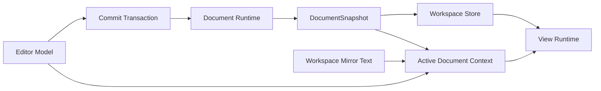

# 主文档数据流

本文只描述主文档主链：

- 核心数据流约束
- 典型业务场景的数据流
- 与数据流直接相关的核心实体关系

不讨论局部实现细节、具体组件拆分、helper 名称。

## 核心实体

只保留和主文档数据流直接相关的实体。

### Editor Model

当前正在编辑的草稿文本和本地编辑现场。

### Commit Transaction

一次主文档写入的提交单元。

### Document Runtime

推进主文档状态、生成事件和提交 snapshot 的运行时。

### DocumentSnapshot

某个时刻的主文档语义单元。

### Workspace Store

前端工作区协调状态和可见绑定关系。

### Workspace Mirror Text

当前 `Editor Model` 不可直接读取时，前端工作区侧保留的最近一次可见文本镜像。

### Active Document Context

把“当前文本从哪里读”和“当前语义该绑定哪个 snapshot”收敛到同一入口的读取上下文。

### View Runtime

Editor / Graph 的可见交互与渲染现场。

## 核心实体关系



关系含义：

- `Editor Model` 是当前草稿文本 authority
- `Commit Transaction` 是写入主文档的唯一提交口
- `DocumentSnapshot` 是成功语义 authority
- `Workspace Store` 保存前端绑定关系和共享状态
- `Workspace Mirror Text` 是 editor model 缺席时的文本回退来源
- `Active Document Context` 负责把文本读取与 snapshot 绑定收敛到同一读取入口
- `View Runtime` 只消费这些状态做可见交互

## 核心约束

### 文本 authority

- 当前文本 authority 优先在 `Editor Model`
- 未挂载或不可直接读模型时，才退回 `Workspace Mirror Text`

### 提交 authority

- 写主文档必须经过 `Commit Transaction`
- 不能从其他路径偷偷推进 authoritative 文档状态

### 语义 authority

- 成功语义来自 `DocumentSnapshot`
- `SnapshotReady + mainGraph` 才是 graph / search / planner / subgraph 的成功基线
- `ParseFailed` 只服务 diagnostics 和 clear graph

### 绑定 authority

- 前端可见 `snapshotId` 绑定关系在 `Workspace Store`
- 但 `snapshotId` 的生成和语义不在前端

## 业务场景数据流

### 1. 用户直接编辑主文档

```text
用户输入
  → Editor Model
  → Commit Transaction
  → Document Runtime
  → DocumentSnapshot
  → Workspace Store
  → View Runtime
```

### 2. 程序化整文替换

```text
程序动作（导入 / preset / language switch / replace）
  → Workspace Store / Editor Model
  → Commit Transaction
  → Document Runtime
  → DocumentSnapshot
  → View Runtime
```

### 3. 主文档语义读取

```text
业务读取需求
  → Active Document Context
  → Snapshot-bound Read
  → Document Runtime
  → DocumentSnapshot 结果
  → View Runtime
```

### 4. parse failed / clear graph

```text
提交失败但仍有诊断
  → Document Runtime
  → ParseFailed
  → diagnostics-only snapshot
  → Workspace Store / View Runtime
```

ParseFailed 场景下允许 `View Runtime` 基于当前 `Editor Model` 触发 transient JSON block analysis：

```text
Editor Model
  → cursor position
  → find JSON block
  → transient Document Job for the block
  → local graph / semantic tokens
  → View Runtime
```

这条链路只服务局部可见体验，例如 JSON block graph、source editor semantic tokens 和定位反馈。它不能绑定为主文档成功 `snapshotId`，不能作为 graph / search / planner / subgraph 的成功基线，也不能绕过 `Commit Transaction` 推进主文档 authority。

### 5. blank / whitespace clear

```text
空文本提交
  → Commit Transaction
  → Document Runtime
  → clear SnapshotReady
  → Workspace Store
  → View Runtime
```

## 主文档数据流检查清单

- 当前文本是不是先落在 `Editor Model`
- 主文档写入是不是都经过 `Commit Transaction`
- 结构化语义是不是都绑定某个 `DocumentSnapshot`
- transient JSON block analysis 是否只服务局部视图，而没有冒充主文档成功语义
- `Workspace Store` 是否只做协调与绑定，而没有重建文档语义
- `View Runtime` 是否只是消费状态，而没有偷偷变成 authority
