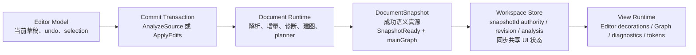
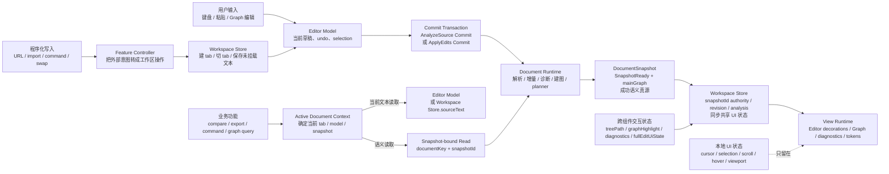

# Editor 数据流职责边界

本文整理 Editor、Workspace、Document Runtime 与 DocumentSnapshot 之间的数据流原则，供后续 agent 评审和执行。它不替代 `CONTEXT.md`、`FRONTEND.md` 或 `bidirectional-edit-pipeline.md`，只把 UI/editor model、store/workspace、runtime/snapshot 在不同场景下的共同流程收敛成一张图。

## 核心原则

所有写文档的路径，都先收敛到 `Editor Model`，再通过唯一的 `Commit Transaction` 进入 `Document Runtime`；所有成功语义读取路径，都只能读带 `mainGraph` 的 `SnapshotReady` snapshot。

- `Editor Model` 是当前草稿真源：负责已挂载文档的当前文本、undo stack、selection 与本地编辑现场。
- `Commit Transaction` 是唯一写入口，但分两类：整文提交使用 `AnalyzeSource Commit`，增量提交使用 `ApplyEdits Commit`。
- `ApplyEdits Commit` 必须携带同 document 的 `baseSnapshotId`；缺少 base snapshot 时必须拒绝或等待，不能偷偷改发整文重建。
- `DocumentSnapshot` 是成功语义真源：`SnapshotReady` 必须带 `mainGraph` 才能成为 graph/search/planner/subgraph 的语义基线。
- `ParseFailed` 可以提交 diagnostics-only snapshot，但它只服务错误展示和清图，不是 graph/search/planner/subgraph 的成功语义基线。
- `Workspace Store` 是前端可见 snapshot binding authority：它保存 tab、revision、snapshotId、analysis 引用、treePath、graphHighlight、fullEditUiState，但不能重新解释文档语义；`workspace-snapshot-bindings.ts` 只是对 `editorStore.actions` 的薄适配层，不是新的 authority。
- `View Runtime` 只管交互渲染现场：cursor、selection、scroll、hover、viewport、临时 decorations 默认留在 editor/graph runtime 本地。
- Graph Search 属于语义读取，目标链路必须绑定 `documentKey + snapshotId`；文本临时 parse 只能作为待迁移 legacy fallback。
- 主文档和 JSON block 都不保留独立 `outputGraph:false` analysis-only 业务链路；diagnostics、semantic tokens 与 JSON block 高亮应来自带 graph 的 Document Job analysis。

一句话判断：

```text
写入统一走 Editor Model -> Commit Transaction；
语义统一来自 DocumentSnapshot；
Workspace Store 只做工作区协调；
View Runtime 只做交互渲染。
```

## 统一术语

| 术语 | 职责 | 不能承担的职责 |
| --- | --- | --- |
| `Feature Controller` | 把 URL preset、import、command、swap、compare/export 操作等用户或程序意图转成具体读写动作。 | 不直接成为文档内容或语义真源。 |
| `Editor Model` | 已挂载 tab 的当前文本、undo stack、selection、编辑事件与本地草稿。 | 不负责解析、建图、结构查询或 snapshot 选择。 |
| `Commit Transaction` | 捕获一次文档提交所需的文本、revision、settings、builder config，以及按提交类型携带的 edits/base snapshot，并启动 document job。 | 不做格式语义判断，不绕过 base snapshot 发起伪增量。 |
| `AnalyzeSource Commit` | 整文提交：打开、导入、全文粘贴、整文替换、format/minify/sort、tab-reactivate、显式 replace fallback。 | 不伪装成增量提交，不要求 `baseSnapshotId`。 |
| `ApplyEdits Commit` | 增量提交：用户局部输入、Graph planner 返回的 edits、workspace content pane 局部提交。 | 缺少同 document 的 `baseSnapshotId` 时不能继续提交，不能静默改走整文重建。 |
| `Document Runtime` | 解析、增量 materialize、diagnostics、semantic tokens、graph build、snapshot 提交、snapshot-bound planner/read。 | 不处理 Svelte/DOM/Monaco 视图状态。 |
| `DocumentSnapshot` | 某个 `documentKey` 在某一时刻的不可变语义单元。成功 `SnapshotReady` 是 analysis、diagnostics、mainGraph 与 snapshot-bound read 的权威载体。 | 不由 Web 预声明 `snapshotId`，不跨 document 复用；`ParseFailed` snapshot 不作为 graph/search/planner/subgraph 的成功语义基线。 |
| `Workspace Store` | tab/workspace 编排、未挂载 tab 文本、active/primary/sidecar 状态、revision、snapshotId 绑定与跨组件共享 UI 状态。 | 不重新解析文本，不构建 graph，不复制 Graph/editor 的临时草稿 authority。 |
| `View Runtime` | Monaco、Graph scene、Leafer、decorations、viewport、hover、scroll 等可见交互运行时。 | 不保存长期文档语义，不绕过 store/runtime 写文档。 |
| `Active Document Context` | 在业务读取前确定当前 document、tab、model、revision、snapshotId 和读取目标。 | 不把旧 snapshot 或旧 model 当作当前状态。 |
| `Snapshot-bound Read` | 显式携带 `documentKey + snapshotId` 的只读语义查询，例如 reveal/path/span/subgraph/planner/graph search。 | 不在 read API 内偷偷创建 snapshot，不用空结果冒充 snapshot 未就绪。 |

## 共同主链

所有改变主文档内容的场景最终都要进入同一条主链：



各阶段作用：

| 阶段 | 输入 | 输出 | 作用 |
| --- | --- | --- | --- |
| `Editor Model` | 用户输入或程序化应用后的文本/edits | Monaco change 或显式 edit payload | 承载当前可编辑草稿，并保留用户期望的 editor 行为。 |
| `Commit Transaction` | 当前文本、revision、settings、builder config；增量提交额外带 `DocumentTextEdit[] + baseSnapshotId` | `DocumentJob` 请求 | 把所有写入统一成可验证、可 freshness guard 的提交。 |
| `Document Runtime` | `AnalyzeSource` 或 `ApplyEdits` job | `EventBatch`、`SnapshotReady` 或 `ParseFailed` | 负责所有核心语义计算、graph build 和 snapshot 提交。 |
| `DocumentSnapshot` | `SnapshotReady` 成功结果；或 `ParseFailed` diagnostics-only 结果 | `snapshotId`、analysis、mainGraph 或 diagnostics-only | `SnapshotReady + mainGraph` 成为后续读取、定位、Graph 编辑 planner 的唯一成功语义基线；`ParseFailed` 只服务错误展示和清图。 |
| `Workspace Store` | snapshot 绑定和共享 UI 状态 | tab/workspace 状态 | 协调多 tab、primary/sidecar、revision 和跨组件可见状态。 |
| `View Runtime` | store 状态、analysis、graph delta | 可见 UI | 渲染 editor/graph/diagnostics/tokens，并维护本地交互现场。 |

## 场景数据流

### 用户文本输入

```text
Editor Model
  -> Commit Transaction
  -> Document Runtime
  -> DocumentSnapshot
  -> Workspace Store
  -> View Runtime
```

说明：

- `Monaco onDidChangeModelContent` 的局部编辑应转换成 `DocumentTextEdit[]`，并携带当前 `baseSnapshotId`，形成 `ApplyEdits Commit`。
- 整文替换、全文粘贴、format/minify/sort、导入、tab-reactivate 使用 `AnalyzeSource Commit`。
- `ApplyEdits` 缺少 base snapshot 时应被拒绝，调用侧不能改发 `AnalyzeSource` 假装增量成功。
- `SnapshotReady.sourceText` 是 runtime 回传的权威写回文本；`ParseFailed` 不提供替换用 source text，也不作为成功语义基线。

### 程序化写入

```text
Feature Controller
  -> Workspace Store
  -> Editor Model
  -> Commit Transaction
  -> Document Runtime
  -> DocumentSnapshot
```

说明：

- 程序化写入包括 URL preset、import、command、swap、tab-reactivate、whole-document replacement。
- `Workspace Store` 负责建 tab、切 tab、保存未挂载 tab 的文本。
- 对已挂载 active tab，最终必须落到 `Editor Model` 应用文本或 edits，再进入共同主链；不能只改 store 后让 editor 被动追。
- 程序化整文写入进入 `AnalyzeSource Commit`；程序化局部 edits 进入 `ApplyEdits Commit`。
- `Editor URL Preset` 只是一进入 `/editor` 时的一次性初始状态和动作集合，不能成为持续驱动运行时状态的 authority。

### Graph 或子图工作区编辑

```text
View Runtime
  -> Snapshot-bound planner(documentKey + snapshotId + path)
  -> DocumentTextEdit[] / explicit replace fallback
  -> Editor Model
  -> Commit Transaction
  -> Document Runtime
  -> DocumentSnapshot
```

说明：

- Graph 不直接改文档；它先通过 snapshot-bound planner 计算 edit plan。
- planner 返回 `edits` 时，UI 把 edits 应用回 `Editor Model`，随后走同一条 `ApplyEdits` 主链。
- planner 明确返回 `replace` 时，UI 才允许把结果作为整文替换应用回 `Editor Model`，随后走 `AnalyzeSource Commit`；fallback reason 必须保留，便于后续收窄 fallback 面。
- 缺少 `snapshotId` 不能静默走 replace fallback；应返回 `SnapshotNotReady` 或等待 snapshot ready。
- 子图 workspace 只是 UI 入口，不是新的 planner authority。
- content pane 的本地草稿 authority 是自己的 Monaco model；GraphViewer 不应复制完整 draft 文本。

### 当前文本读取

```text
Feature Controller
  -> Active Document Context
  -> Editor Model / Workspace Store.sourceText
```

说明：

- compare、export、command 如果只需要用户当前看到的文本，应先建立 `Active Document Context`。
- 已挂载 active tab 必须优先读 `Editor Model`，因为它持有当前草稿和 undo/selection 现场。
- 如果当前没有 Monaco model，再退回 `editorIO.getText()`；只有 editor runtime 也缺席时，才退回 active workspace tab / `Workspace Store.sourceText`。
- 未挂载或 background tab 可以读 `Workspace Store.sourceText`。
- 读取当前文本不等于读取结构语义；需要结构语义时必须走 snapshot-bound read。

### 语义读取

```text
Feature Controller
  -> Active Document Context
  -> Snapshot-bound Read(documentKey + snapshotId)
  -> Document Runtime
```

说明：

- graph query、graph search、subgraph、reveal、path/span、Graph edit planner、结构化 compare/export 都属于语义读取。
- 缺少 ready snapshot 时返回 `SnapshotNotReady` 或等待；不能从 store 临时重建语义。
- `SnapshotNotReady` 不能在 Web domain service 层被吞成 `null` 或空数组；只有 UI 展示边界可以把它降级为空态、loading、disabled 或 toast。
- 主图只消费 `DocumentJob` events 与 `SnapshotReady.mainGraph`，不要回到 `buildProjection('mainGraph')` 或其他 read API 补主图。
- `SnapshotReady` 成功链路必须带 `mainGraph`；`ParseFailed` 只用于 diagnostics 与 clear graph，不用于 graph/search/planner/subgraph。

### UI 状态

```text
local interaction:
  View Runtime local state

shared interaction:
  View Runtime
    -> Workspace Store.tempModel
    -> Other View Runtime

semantic UI:
  DocumentSnapshot.analysis
    -> Workspace Store
    -> View Runtime
```

说明：

- cursor、selection、scroll、hover、viewport、临时 decorations 默认属于 `View Runtime local state`。
- treePath、graphHighlight、diagnostics、fullEditUiState 这类跨组件共享状态进入 `Workspace Store`。
- diagnostics、semantic tokens、Graph 等语义 UI 必须由带 graph 的 Document Job analysis、`SnapshotReady.mainGraph` 或 snapshot-bound read 派生。

## 总览图



## 执行方案

后续 agent 执行重构或评审时，优先按以下顺序收敛：

1. 先列出所有入口：用户编辑、URL preset、import、command、swap、Graph edit、workspace content pane、compare/export。
2. 对每个写入口确认是否最终进入 `Editor Model -> Commit Transaction`。没有进入的入口需要改造成同链路，或明确说明为什么它不是文档写入。
3. 对每个写入口标注提交类型：整文提交走 `AnalyzeSource Commit`，增量提交走 `ApplyEdits Commit`。
4. 对每个 `ApplyEdits Commit` 确认是否带同 document 的 `baseSnapshotId`；缺失时必须拒绝或等待。
5. 对每个读取入口标注读取目标：当前文本、语义、主图、共享 UI 状态、本地 UI 状态。
6. 当前文本读取通过 `Active Document Context` 选择 `Editor Model` 或 `Workspace Store.sourceText`。
7. 语义读取必须显式携带 `documentKey + snapshotId`，并正确处理 `SnapshotNotReady`。
8. 主图只消费 job events 与 `SnapshotReady.mainGraph`；`SnapshotReady` 缺少 mainGraph 视为成功链路不成立。
9. Graph Search 收敛为 snapshot-bound semantic read；文本 parse 搜索只能作为待迁移 fallback。
10. 删除或迁移主文档 / JSON block 的 `outputGraph:false` analysis-only 链路；JSON block 高亮跟随 `json-block` graph job analysis。
11. 将前端 `snapshotId` authority 收敛到 `Workspace Store`；不再保留独立状态的 `DocumentSessionService` 或兼容 facade。
12. 检查 `Workspace Store` 是否承担了解析、建图、planner、source authority 之外的职责；发现后向 runtime 或 editor model 回收。
13. 检查 `View Runtime` 本地状态是否被不必要地提升到全局 store；只保留跨组件共享状态。

## 评审检查清单

- 写文档的路径是否有且只有一个提交口：`Commit Transaction`。
- `Commit Transaction` 是否明确区分 `AnalyzeSource Commit` 与 `ApplyEdits Commit`。
- `ApplyEdits` 是否总是带同 document 的 `baseSnapshotId`。
- Graph edit 是否先走 snapshot-bound planner，再把 edits 回流到 `Editor Model`。
- Graph edit 的 `replace` fallback 是否由 planner 显式返回，并保留 fallback reason；缺 snapshot 是否避免静默 replace。
- `Workspace Store` 是否只保存 workspace/tab 状态和共享 UI 状态，没有重新解释文档语义。
- 前端 `snapshotId` authority 是否只在 `Workspace Store`，没有独立 registry 与 workspace 双写分叉。
- 已挂载 active tab 的当前文本读取是否优先读 `Editor Model`。
- 语义读取是否全部携带 `documentKey + snapshotId`。
- 缺少 snapshot 时是否在 service 层返回未就绪，而不是空结果、重试 probe 或偷偷创建 snapshot。
- 主图是否只来自 job events 与 `SnapshotReady.mainGraph`。
- 成功 `SnapshotReady` 是否带 `mainGraph`；`ParseFailed` 是否只用于 diagnostics / clear graph。
- Graph Search 是否避免临时 parse 当前文本作为目标语义。
- 是否还有主文档或 JSON block 的 `outputGraph:false` analysis-only authority 链路。
- UI 本地状态是否尽量留在 `View Runtime`，没有无故进入全局 store。
- 异步写回 UI、store、editor model、graph scene、diagnostics 或 tree state 时是否使用统一 freshness guard。

## 相关文档

- `CONTEXT.md`：Document Runtime、DocumentSnapshot、DocumentJob、snapshot-bound read 的权威语境。
- `docs/FRONTEND.md`：Web、Worker、GraphViewer、Workspace 与 freshness 约束。
- `docs/bidirectional-edit-pipeline.md`：Editor ↔ Graph 双向编辑如何收敛到 snapshot 主链。
- `docs/user-stories.md`：这些数据流服务的用户路径与体验目标。
