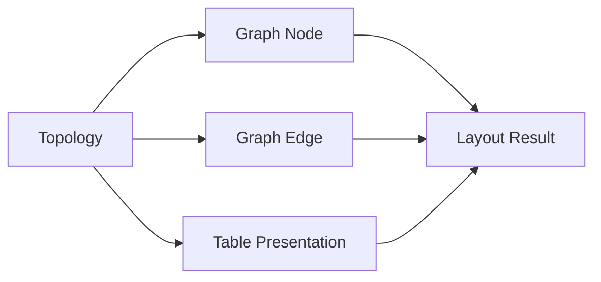

# 布局约束

本文用于约束 layout 的正确性。

本文回答四个问题：

1. 哪些结构会生成独立节点
2. 不同节点类型应该如何表现
3. 已生成节点如何计算位置与连接
4. full build、streaming、changed-region 下哪些结果必须一致，以及哪些结果一出现就说明布局错了

## 输入与输出

### 输入

- topology：父子关系、结构类型、可见性、内联/展开判定
- node intrinsic size：节点自身宽高与内部行高
- spacing config：`h_gap`、`v_gap`
- table row / cell anchor：表格行与结构值的语义锚点

### 输出

- graph node 的可见集合
- 每个 node 的几何结果：`x / y / width / height`
- 每条 edge 的起终点锚定位置
- table 相关的 row / cell 几何结果

## 核心实体

### Topology

决定谁是父、谁是子、谁独立可见、谁以内联值存在的结构语义。

### Graph Node

布局阶段需要摆放的独立可见节点。

### Graph Edge

表达父子结构语义的连接。

### Table Presentation

`Sequence` / `Object` 在表格阅读形态下的内部呈现。

### Layout Result

布局阶段输出的节点、边与表格几何结果。

## 核心实体关系

## 一、节点判定

### Tree 结构到图结构的映射

| Tree 结构 | 默认图形语义 |
| --- | --- |
| `Mapping` | `Object` |
| `Sequence` | `Headerless Table` 或 `Header Table` |
| 其他（`Scalar`、`Alias` 等） | `Scalar` 或父节点内联值 |

### 独立节点规则

- `Mapping` 默认生成 `Object` 节点。
- `Sequence` 默认生成 `Table` 节点，但它有两种表现：`Headerless Table` 和 `Header Table`。
- 空 `Mapping` 不生成 `Object` 节点，而是退化成 `Scalar` 节点。
- 空 `Sequence` 不生成 `Table` 节点，而是退化成 `Scalar` 节点。
- 普通 scalar 默认不单独升级成主图节点，而是作为父节点中的值内联展示。
- header-table row 永远属于父 `Table` 的内部呈现，不成为独立主图节点。
- headerless table row 同样不是独立主图节点。
- row 内 nested container cell 可以成为进一步阅读 / 展开的入口，但它不是主图 row node。

### sequence 分化规则

`Sequence` 是否表现成 `Header Table`，按当前规则只看首项：

- 空 sequence：不是 `Header Table`，按 `Headerless Table` 处理。
- 首项是 `Mapping`：整个 sequence 按 `Header Table` 处理。
- 首项不是 `Mapping`：整个 sequence 按 `Headerless Table` 处理。

这意味着：

- `Header Table` 的判定不是“多数项是否是 object”，也不是“所有项是否同构”。
- 一旦首项是 `Mapping`，后续即使混入非 `Mapping` 项，整体仍按 `Header Table` 组织；这些非 `Mapping` 项落到 fallback `value` 列。
- 一旦首项不是 `Mapping`，后续即使出现 `Mapping` 项，整体仍按 `Headerless Table` 组织，不再升级成带 header 的表。

### 节点判定的一致性要求

- full build、streaming、changed-region 下，对“是否独立成节点”的判断必须一致。
- 不能因为执行路径不同，把同一结构有时内联、有时升级成独立节点。
- 不能为了局部 relayout 方便，把 table row 或局部值临时抬升成主图节点。

## 二、节点表现

### `Scalar`

- 单 `Scalar` 节点固定是单行表现，不再拆出额外的 key 列。
- 它的 key 区为空，value 区承接全部可见文本。
- 空 `Mapping`、空 `Sequence`、以及普通 scalar 进入该分支后，遵守同一套单行样式。
- 单 `Scalar` 的宽度由 value 文本决定；高度按单行 row 高度计算。

### `Object`

- `Object` 的基本阅读单元是 `key/value` 行。
- 每个字段在视觉上至少要保留“字段名区域”和“字段值区域”的区分。
- object 内若某个值是可继续展开的结构值，它在当前 object 中仍先表现为当前行的 value 语义，再通过 edge 或后续展开进入更深层节点。

### 空容器退化

- 空 `Mapping` 退化成单 `Scalar` 表现，显示空 object 的摘要值，而不是空 `Object` 框。
- 空 `Sequence` 退化成单 `Scalar` 表现，显示空 sequence 的摘要值，而不是空 `Table` 框。
- 这条规则对 full build、streaming、changed-region 一致生效；不能在某条路径里把空容器画成 scalar，另一条路径里画成空 object / 空 table。

### `Headerless Table`

- 它用于“首项不是 `Mapping`”的 sequence。
- 它的阅读语义接近 object node 的 `key/value` 行，但 `key` 区显示的是 sequence index。
- 每一行固定是两列：index 列 + value 列。
- 行内值仍可对应结构值；如果某个 item 是可独立展开的 container，它可以通过 edge 连到子节点。

### `Header Table`

- 它用于“首项是 `Mapping`”的 sequence。
- 它按 header + body 的表格语义展示，而不是 object 式两列行。
- 列集合来自所有 mapping item 中可见 key 的稳定并集。
- 第 0 列始终是 index 列。
- 如果 sequence 中存在非 `Mapping` 项，或所有 mapping 都没有可见 key，则必须追加 fallback `value` 列承接这些值。
- row 是 table 内部呈现单元，不独立升级成主图节点。

### `Header Table` 的 fallback `value` 列规则

- 只要 sequence 中任一项不是 `Mapping`，就需要 fallback `value` 列。
- 或者，所有 `Mapping` 项都没有可见 key 时，也需要 fallback `value` 列。
- fallback `value` 列用于承接不能投影到 header key 集合中的整项值。

### virtual table

`virtual table` 不是新的节点类型，而是 `Table` 节点在 body 高度超过可视高度时的表现方式。

触发条件：

- `table.total_height > table.view_height`
- 等价地说，table body 的内容高度超过当前允许的 viewport 高度
- `view_height` 由 `table_max_height` 截断，因此大表会进入这个分支

表现要求：

- 节点语义仍然是同一个 `Table` 节点，不会因为 virtualization 拆成多个节点。
- header 若存在，保持为 table 头部区域；滚动的是 body，不是整张表的语义身份。
- body 只渲染当前可见窗口附近的 row，而不是一次性物化全部 row。
- row 的 index、path、anchor 语义不变；virtualization 只改变“当前哪些 row 被渲染到 viewport 中”。
- 外部命中测试、reveal、highlight、edge 锚点都必须仍以真实 row 语义为准，不能因为 row 当前未渲染就丢失语义定位。

## 三、几何规则

### X 方向规则

- 根节点从 `x = 0` 开始。
- 某层列坐标 = 上一层所有节点最右边界最大值 + `h_gap`。
- 因而同一深度的节点共享同一列坐标，而不是每个父节点单独推导自己的子列。
- 如果某个增量更新只影响局部子树，它可以只重算受影响区域；但重算结果仍必须满足“同层共享列”语义。

### Y 方向规则

- 某深度第一个节点的 `y` 以其父节点的语义起点为基准。
- 同层后续节点的 `y` 至少要满足：
  `max(父节点 y, 该层当前已放置内容的底部 + v_gap)`。
- 因而同层节点必须既保持阅读顺序，也避免互相覆盖。
- changed-region relayout 可以移动受影响区域及其必要传播范围，但不能无理由改写稳定区域已有的上下顺序。

### edge 规则

- edge 起点 `x` 取父节点右边界附近的语义出边位置。
- edge 终点 `x` 取子节点左边界附近的语义入边位置。
- edge 起点 `y` 绑定父节点中“与该子节点关联的 value 位置”，而不是父节点几何中心。
- edge 终点 `y` 绑定子节点首个可见语义入口的位置，而不是子节点几何中心。
- 当父节点是 table 时，edge 的纵向锚点应跟随对应 row 的真实位置变化；table 增长或局部重排后，edge 不能继续挂在旧 row 上。

## 四、一致性约束

### full build / streaming 一致性

- full build 与 streaming 最终必须收敛到同一套节点生成与布局结果。
- chunk 期间允许只发布局部增量，但 close 后结果不能与 full build 的最终布局语义冲突。

### changed-region 一致性

- changed-region relayout 应尽量只影响必要区域。
- 局部更新后，未受影响区域不能无理由换列、换序、跳位。
- table 增长允许局部扩展，但不能每次都把整张图重排成一张“新图”。

### 几何一致性

- 同层节点必须共享同一列语义。
- 同层节点不能重叠。
- edge 必须锚定当前真实语义位置，不能滞留在旧几何结果上。
- virtual table 的可见窗口可以变化，但 table 自身的节点身份、row 索引语义和 reveal / anchor 语义不能变化。
- 空 `Mapping`、空 `Sequence` 在任何构建路径里都必须保持单 scalar 几何，而不是有时占用 object/table 几何。

## 五、明确错误

以下结果一出现，就说明 layout 错了：

- 同一深度节点出现在不同列，但它们本应共享同层列。
- 某层列坐标没有遵守“上一层最右边界最大值 + `h_gap`”。
- 同层节点上下重叠，或后续节点越过前面节点的底部。
- edge 挂在父节点或子节点的几何中心，而不是对应语义位置。
- table 增长、row 高度变化或局部重排后，edge 仍挂在旧 row 上。
- full build 与 streaming 对同一结构给出了不同的节点可见性或最终布局。
- changed-region relayout 在无必要时改写稳定区域既有顺序或列对齐。
- 同一个 sequence 在一次构建里表现成 `Headerless Table`，在另一条构建路径里却表现成 `Header Table`。
- table 已进入 scroll / virtual 分支，但 reveal、hit test 或 row anchor 仍按旧可见窗口中的 row 几何工作。
- 空 `Mapping` 或空 `Sequence` 被画成空 object / 空 table，而不是单 scalar。

## 检查清单

- 当前改动是否改变了哪些结构会成为独立节点
- 当前改动是否仍满足同层共享列
- 当前改动是否仍满足同层不重叠和父先子后
- 当前改动后的 edge 是否仍锚定真实语义位置
- full build、streaming、changed-region 的结果是否仍然收敛
