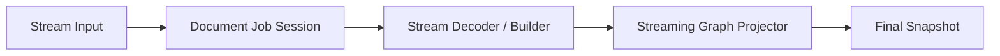

# 流式处理

本文只描述 streaming 这条专题链路：

- 流式处理的数据流
- 流式处理的实现约束
- 与流式处理直接相关的核心实体关系

## 核心实体

### Stream Input

来自内存切块或 `ReadableStream` 的输入片段。

### Document Job Session

流式推进一次 job 的会话实体。

### Stream Decoder / Builder

把 chunk 转成结构事件并维护中间结构语义的实体。

### Streaming Graph Projector

在 chunk 期间持续生成 graph 增量的实体。

### Final Snapshot

close 后的最终 authoritative snapshot。

## 核心实体关系



## 数据流

### same-language JSON 真流式

```text
File.stream / chunk source
  → job start（固定 parser.enableNest / formatting.smart / formatSourceOnClose）
  → Document Job Session
  → advanceDocumentJob(chunk)
  → Stream Decoder / Builder（enableNest 在这里开始影响 decoder / source rewrite / path）
  → Streaming Graph Projector
  → ProjectionDelta
  → close（如启用 smart + formatSourceOnClose，在这里生成最终 formatted sourceText）
  → Final Snapshot
```

### 非 JSON 假流式

```text
chunk source
  → Document Job Session
  → 缓存 source
  → close
  → decode / materialize
  → Final Snapshot
```

### `ApplyEdits`

```text
edits + base snapshot
  → job start
  → materialize with base
  → Final Snapshot
```

它复用统一 job API，但当前不属于 parser-level 真流式。

## 时序位置

### `enable nest parse`

`enableNest` 在 job start 时进入 parser settings，并在首个 chunk 初始化 stream state 时生效。

```text
job start
  → StreamState::for_language(..., settings)
  → chunk feed
  → decoder.feed / take_source_rewrites
  → source_doc.commit_events
  → builder.push
  → projector.update
  → ProjectionDelta
```

它的位置含义是：

- 它属于 chunk 期间语义，不是 close 后补做的修正
- 它会影响 decoder 产出的结构事件、source rewrite、path 语义和增量 graph 投影
- close 只是把这套已生效的 nested 语义收口成 final snapshot / sourceText

### `enable auto format`

这里的 auto format 指 `formatting.smart = true` 且 `formatSourceOnClose = true`。

```text
chunk feed
  → decoder / builder / projector 按原始 streaming 语义持续推进
  → close
  → builder.take_document
  → format_json_document_with_spans
  → 写回最终 formatted sourceText
  → Final Snapshot
```

它的位置含义是：

- 它不参与 chunk 期间的 `ProjectionDelta` 生成
- 它只在 close 收尾时执行，用来生成最终 authoritative `sourceText`
- 如果 nested expansion 已重写 source，则先收敛出 canonical rewritten source，再在 close 阶段决定是否做最终 smart format

## 实现约束

### 真流式约束

- JSON same-language 文件导入必须在 close 前就能产出真实 `ProjectionDelta`
- chunk 期间产生的 graph 语义不是“假预览”
- close 后仍要以 final `SnapshotReady.mainGraph` 收口

### 假流式约束

- 非 JSON chunk 输入只是 transport chunking
- close 前不能伪装成已完成 graph 构建

### clear / parse failed 约束

- blank / whitespace close 必须提交 authoritative clear snapshot
- parse failed 必须走 diagnostics-only 分支
- 不能保留看似成功的旧 graph
- parse failed 后允许基于当前 `Editor Model` 做 transient JSON block analysis，但该 analysis 只能服务局部 View Runtime；不能被写成主文档 `SnapshotReady`，也不能复用或保留旧主图来伪装成功

### nested JSON 约束

- enableNest 生效时，chunk 期间 path、source rewrite、ProjectionDelta、close 后 sourceText、后续 snapshot-bound read 必须保持同一套 nested path 语义

### auto format 约束

- smart format 只能在 close 收尾时改写最终 `sourceText`
- chunk 期间已经发布的 `ProjectionDelta` 不能依赖 close 阶段格式化来“纠偏”
- close 后返回的 final `sourceText` 必须与最终 snapshot 使用同一份 canonical source

### root scalar replace 约束

- close 收口时，root scalar whole replace 必须清掉旧 root graph 残留

## 检查清单

- 这个场景到底是真流式、假流式，还是非流式提交
- close 前是否允许产出 `ProjectionDelta`
- close 后是否一定回到 final `SnapshotReady.mainGraph`
- parse failed / blank clear 是否正确分流
- parse failed 下的 JSON block 分析是否是独立 transient job，而不是旧 graph fallback
- 有没有靠 close 去“修正”早先错误发布的图语义
