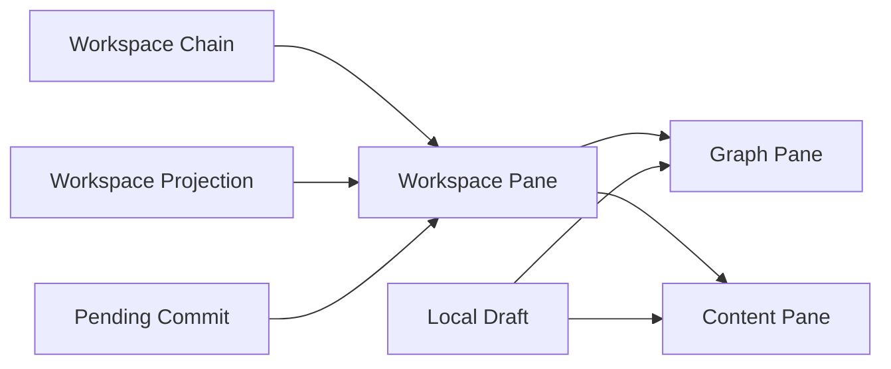

# 子图工作区

本文只描述 `Subgraph Workspace` 这个产品子域：

- 子图工作区约束
- 子图工作区的数据流
- 与子图工作区直接相关的核心实体关系

## 核心实体

### Workspace Chain

底部工作区当前打开的一条 pane 链。

### Workspace Pane

工作区中的单个阅读 / 编辑单元。

### Graph Pane

以 graph canvas 形式展示某个结构化 path 的 pane。

### Content Pane

以 Monaco value editor 形式展示某个标量 path 的 pane。

### Workspace Projection

基于当前 snapshot 与 path 读取出的局部图或局部值结果。

### Local Draft

content pane 或 graph pane 当前正在编辑的本地草稿。

### Pending Commit

某个 pane 对同一路径尚未完成的提交状态。

## 核心实体关系



关系含义：

- `Workspace Chain` 管理当前打开的 pane 链路
- 每个 `Workspace Pane` 要么是 `Graph Pane`，要么是 `Content Pane`
- pane 内容来自某个 `Workspace Projection`
- 编辑中的 pane 会持有 `Local Draft`
- 提交中的 pane 会进入 `Pending Commit`

## 子图工作区约束

### 子域定位

- 子图工作区是 GraphViewer 底部的持久工作区
- 它不是 hover 预览
- 它不是第二套主图 authority
- 它不是新的文档 authority

### pane 约束

- 工作区最多保留 3 个可见 pane
- 当用户沿某条路径继续下钻时，pane 链仍按祖先链和当前分支组织
- 当 pane 总数超过 3 个时，不再压缩链路语义，而是通过横向滚动显示完整链路；可见窗口同时最多展示 3 个 pane
- pane 标题用于表达当前 path，但不引入额外路径轨 UI

### graph / content 分流约束

- 普通 object / array 默认进入 `Graph Pane`
- 普通 scalar 默认进入 `Content Pane`
- 空容器 `{}` / `[]` 是例外：当前按单 cell 内容进入 `Content Pane`
- miss placeholder cell 不能继续打开 pane

### projection 约束

- 工作区读取必须绑定当前 active snapshot
- graph pane 读取的是 workspace projection，而不是重建主图
- content pane 展示的是绑定 path 的局部值，不是新的独立文档

### 编辑约束

- graph pane 与 content pane 只是不同入口，不是两套提交体系
- graph pane 的草稿 authority 在图侧编辑运行时
- content pane 的草稿 authority 在它自己的 Monaco model
- content pane 不额外展示 key 输入框，默认只编辑 value

### 生命周期约束

- whole replace / import / language switch / initial example 等整文语义重建期间，工作区应 reset
- snapshot、revision、renderConfig、enableNest 变化会触发对应 pane refresh 或 cache 失效
- pane 被关闭或从链路中移除时，应释放对应 runtime 和临时状态

## 数据流

### 1. 主图点击打开工作区

```text
Graph click
  → reveal / editor 联动
  → 计算 path 与 target
  → 读取 Workspace Projection
  → 生成 Graph Pane 或 Content Pane
  → 更新 Workspace Chain
```

### 2. 在 graph pane 中继续下钻

```text
Workspace graph pane click
  → rebase path
  → reveal / editor 联动
  → 读取下一层 Workspace Projection
  → 在右侧继续展开 pane
```

### 3. 在 content pane 中编辑

```text
Monaco local draft
  → content pane blur / change 提交
  → Pending Commit
  → 复用现有 graph edit / planner / commit 主链
  → 主文档更新
  → 工作区 refresh
```

### 4. 外部主文档刷新影响工作区

```text
主文档 snapshot / revision 变化
  → 工作区 refresh 判定
  → clean 且未聚焦的 content pane 允许回灌
  → dirty 或 focused 的 content pane 保留本地草稿
```

### 5. 同一路径连续提交

```text
第一次提交未完成
  → 记录 Pending Commit
  → 后续输入覆盖 latest queued draft
  → 当前提交完成后补交最新草稿
```

## 工作区专有规则

### path 规则

- 主图点击得到的 path 是工作区入口 path
- graph pane 内继续点击得到的 path 可能是相对 path，需要 rebase 回工作区根 path
- 工作区内部 reveal、编辑、后续打开 pane 都以 rebased path 为准

### cache 规则

- graph cache 只缓存同一 `documentKey + snapshotId + revision + renderConfig + enableNest` 组合下的 projection 结果
- 组合变化时必须整体失效

### 交互一致性规则

- graph pane 的 canvas 交互应尽量与主图一致
- 默认缩放、拖动和平移边界应保持一致语义
- 工作区阅读不应切断 editor reveal / graph highlight 的联动

## 检查清单

- 工作区是否被错误地实现成新的文档 authority
- pane 分流是否仍符合 graph / content 的产品规则
- 空容器是否仍走 content pane
- pane 链是否仍遵守“可见窗口最多 3 列，完整链路通过横向滚动保留”的规则
- 超过 3 个 pane 时是否通过横向滚动保留完整链路
- content pane 的本地草稿是否被外部 refresh 错误覆盖
- 同一路径连续提交是否只保留并提交最新草稿
- graph pane 的 path 是否在下钻前正确 rebase
