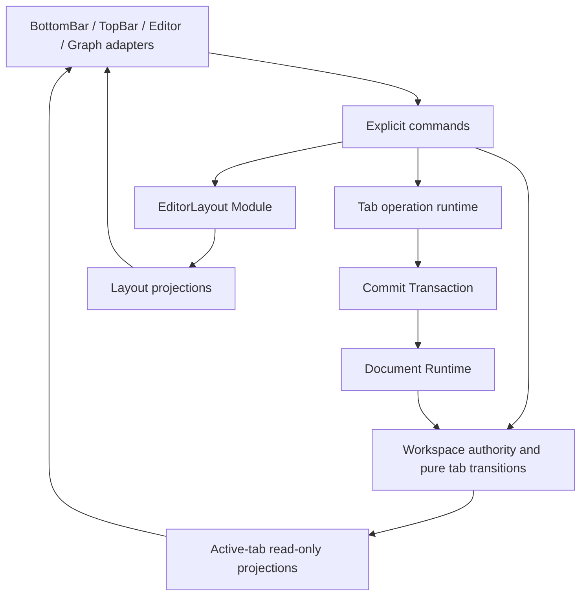

# Tab 状态与文档操作生命周期交接设计

## 背景

Treease 已将左侧 Tab 拓扑逐步收敛到 `EditorWorkspaceState`，但文档操作、可见 UI 状态和布局状态仍存在不同程度的 active-tab 假设或全局单槽所有权。典型风险包括：

- Tab A 发起导入、格式化或 whole-document replacement 后切到 Tab B，异步结果仍按完成时的 active model、language 或全局状态落地，可能覆盖 B；
- 切换 Tab 会取消 A 的 `DocumentJob`，或者 A 的操作状态使 B 也进入 readOnly / blocked；
- full-edit、import、format 等状态由全局 store、workspace tab 和组件本地字段共同维护，形成双写或循环同步；
- Graph render attachment、operation runtime 和 Tab lifecycle 对取消与清理的所有权不清，可能提前取消后台任务或重复 cleanup；
- 因“与 Tab 强相关”而把分栏宽度、导航区高度等窗口几何也放入 Tab，导致职责混杂和切换时布局跳变；
- BottomBar language 同时作为展示状态和隐式双向写入口，无法清晰区分“切换到另一语言的 Tab”和“用户主动修改当前文档语言”。

本设计延续 [统一编辑器 Tab 生命周期](./tab-lifecycle-unification-plan.md) 的拓扑与 Monaco model 所有权，不新增第二套 workspace authority；同时遵守 [Editor Data Flow Contract](./contracts/editor-data-flow.md)、[Document Runtime Contract](./contracts/document-runtime.md)、[Bidirectional Edit Contract](./contracts/bidirectional-edit.md) 和 [Column Navigator Contract](./contracts/column-navigator.md)。更完整的异步操作行为与验证场景见 [按 Tab 收敛编辑器文档操作生命周期](./tab-scoped-document-operation-lifecycle-plan.md)。

## 目标

建立一套统一、可判定的状态归属和文档操作生命周期，使实现者能够仅根据“状态描述的对象”和“谁有权修改它”确定其 Module，而不是根据组件位置或是否出现在 Tab 页面中判断。

完成后应满足：

1. `EditorWorkspaceState` 是左侧 Tab 拓扑、Tab 文档绑定和 Tab-local 可序列化/可投影状态的唯一事实来源。
2. `EditorLayoutState` 独立拥有当前工作区/窗口的 UI 几何；布局状态不进入单个 Tab。
3. 每个左侧 Tab 最多拥有一个 current document-operation generation；同 Tab 新操作替换旧操作，不同 Tab 互不取消、互不阻塞。
4. 所有异步操作在启动时捕获稳定 target；Tab switch 不改变归属，Tab close 或 same-tab supersede 会同步使旧 target 失效。
5. 文档结果落地与当前可见 UI 落地分开判断；后台 Tab 可以更新自己的文档事实，但不能修改 active Tab 的 Editor、Graph、diagnostics、cursor 或 toast。
6. `Commit Transaction` 仍是 primary-document 写入的唯一入口；`Document Runtime` 仍是 snapshot、parse result 和 graph 语义的唯一 authority。
7. active store 只作为 active Tab 的只读投影；组件通过显式 command 修改 authority，不通过投影反向同步或维护第二份状态。
8. 旧的 global operation slot、双写 coordinator、无 target 的 deferred state 和重复取消路径在迁移完成后删除，只保留一条 canonical path。

### 非目标

- 不修改 Core protocol、WASM Document Runtime 或 snapshot 语义；
- 不承诺底层 Worker 物理并行，也不新增 Worker pool；
- 不把 sidecar 纳入左侧 Tab operation registry；
- 不持久化 Promise、Job、session、generation、queue、RAF 或 stream reader；
- 不以扩大有限 replay window 的方式恢复后台 streaming Graph；
- 不将所有 view-local 状态都立即持久化，持久化必须有独立产品语义。

## 关键数据流和设计决策

### 1. 状态按对象归属，而不是按组件归属

| 状态类别 | 事实来源 | 示例 | Tab 切换行为 | 持久化策略 |
| --- | --- | --- | --- | --- |
| 文档事实 | `EditorWorkspaceTab`，active 文本编辑时由 resident `Editor Model` 提供 draft authority | `languageId`、`sourceText` mirror、`revision`、`snapshotId` | 随 Tab 切换 | 仅保存既有草稿/session 字段 |
| Tab 视图记忆 | `EditorWorkspaceTab.viewState` 或等价 tab-local state | cursor、scroll、Graph camera、Navigator active path | 随 Tab 切换并恢复 | 默认 runtime-only；有明确产品需求后再持久化 |
| Tab 操作展示 | `EditorWorkspaceTab.operationUiState` | phase、progress、interaction mode、error | 随 Tab 切换；active 时成为投影 | 不持久化，恢复后为 idle |
| 工作区布局 | 独立 `EditorLayoutState` | Graph ↔ Editor `splitRatio`、Column Navigator height/open | 不随 Tab 切换 | 按浏览器/设备设置持久化 |
| 用户偏好 | Settings | theme、formatting defaults、parser preferences | 不随 Tab 切换 | 按现有 Settings 契约持久化 |
| 异步资源 | `EditorCore` 私有 tab operation runtime | generation、Job、reader、RAF、queue、cancel owner | 按 `tabId` 隔离 | 禁止持久化 |

三个已知状态的决策如下：

- Graph ↔ Editor 分栏宽度属于工作区几何，继续由 `EditorLayoutState.splitRatio` 管理；不得为每个 Tab 复制一份。
- Column Navigator 高度和展开状态属于工作区几何；Navigator active path、选择和局部滚动才属于 Tab 视图记忆。
- BottomBar 选中的语言是文档解释方式，必须来自 `EditorWorkspaceTab.languageId`；BottomBar 只是 active projection 的展示与命令入口。

### 2. 文档语言保持单向数据流

```text
EditorWorkspaceTab.languageId
  → activeLanguageId read-only projection
  → BottomBar / Editor / Graph

BottomBar user selection
  → setTargetTabLanguage(activeTabId, languageId)
  → targeted whole-document transition
  → EditorWorkspaceTab + resident Editor Model
  → Commit Transaction
  → Document Runtime
  → snapshot binding / visible projection
```

BottomBar 不应通过监听 store 变化推断用户行为。选择控件应使用显式 change command：Tab activation 只改变投影，不上报 `language_selected`，只有用户选择才执行语言切换和埋点。

### 3. 布局状态形成独立闭环

```text
resize/open/close gesture
  → EditorLayout command
  → EditorLayoutState
  → page / GraphViewRuntime layout projection
```

布局 Module 不读取或修改 document identity、snapshot、Graph semantics 或 Tab topology。GraphViewRuntime 可以作为布局交互 adapter，但不得成为持久化布局的第二 authority。

### 4. 每个异步操作捕获稳定文档目标

full-edit、file import、conversion、format 和 whole-document replacement 开始时，必须捕获至少以下身份：

```ts
type EditorDocumentOperationTarget = {
  tabId: string;
  model: Monaco.editor.ITextModel;
  ownerKey: string;
  documentKey: string;
  revision: number;
  languageId: SupportedEditorLanguageId;
  generation: number;
};
```

异步回调不得重新读取完成时的 `activeTabId`、active model 或 active language 来恢复原操作意图。

### 5. 分离 document freshness 与 visible freshness

Document freshness 决定结果是否仍可提交给产生它的文档，至少要求：目标 Tab 仍存在、generation 相同、resident model 未释放且仍属于该 Tab、`documentKey + revision + language` 未变化、操作未取消。

Visible freshness 决定结果是否可以进入当前可见 UI；它在 document freshness 之外还要求：目标 Tab 当前 active、Editor 安装的是目标 model、active document context 与 target 身份一致。

```text
async result
  → document freshness false → discard + idempotent cleanup
  → document freshness true
      → document landing: target model/workspace/semantic binding
      → visible freshness true
          → visible landing: Graph/diagnostics/cursor/toast
      → visible freshness false
          → no visible side effect
```

`activeTabId` 只参与 visible freshness，不参与 document freshness。因此切换 Tab 不会使后台操作自动 stale。

### 6. 操作和取消所有权按 Tab 收敛

`EditorCore` 私有 runtime 以 `tabId` 索引 operation owner，拥有 generation、full-edit/import session、conversion operation、stream reader、RAF、pending chunks、format ordering 和 `DocumentJob` cancellation。它只协调资源生命周期，不拥有 Tab 拓扑、文档语义或布局。

Graph render attachment 只拥有 batch consumer / render attachment。Tab switch 或 Graph detach 只能 detach consumer；只有 same-tab supersede、Tab close、Editor dispose 或显式用户取消可以由 operation owner 取消 Job。

有限 replay window 不能被视为完整 Graph baseline。后台 Tab 重新激活时，如果无法证明 streaming replay 完整，应等待 authoritative terminal snapshot，再执行 canonical render。

### 7. Whole-document replacement 只有一个目标化入口

format/minify/compact/sort、import conversion、language switch、preset/share/file replace 和其他 programmatic replacement 都进入同一个 targeted replacement Module：

```text
capture target
  → invalidate old generation for the same tab
  → narrow target-document transition
  → update target Editor Model and workspace mirror
  → Commit Transaction
  → Document Runtime terminal result
  → document landing
  → optional visible landing
```

普通 workspace patch 不得获得任意修改 inactive Tab identity 的能力。应提供窄 transition，校验旧 identity 后原子更新目标 Tab 的 `documentKey`、language、revision、source mirror，并清理旧 snapshot binding。

### 8. 模块职责与依赖方向



- Workspace authority 管拓扑、文档绑定和 tab-local state；不解释 snapshot 语义。
- 纯 transition 不依赖 Svelte、Monaco、Worker 或 Document Runtime。
- Operation runtime 管协调和资源清理；不管理 Tab 顺序、布局或 Graph 语义。
- Commit Transaction 是唯一文档写入入口。
- Document Runtime 独占 snapshot 和 parse/graph 语义。
- UI adapter 只发命令、消费投影，不直接跨组件同步状态。
- 如 active projection 会造成 `editor-workspace` 与 store 的 import cycle，应先把纯状态类型、initial value 和转换函数提取到无 Svelte 依赖的 leaf Module，再由 workspace 和 projection 单向依赖它；不得用反向 import 或兼容双写绕过循环依赖。

## 状态规则与约束

### Authority 规则

1. 一个事实只能有一个可写 authority；projection、mirror 和 cache 必须明确标注且不得反向写入事实源。
2. `EditorWorkspaceState` 是左侧 Tab topology 的唯一 authority；组件不得保存第二份可变 Tab 列表或 active id。
3. resident `Editor Model` 是当前 draft text authority；`EditorWorkspaceTab.sourceText` 是 inactive/unmounted、session 和 binding 所需镜像，不是竞争性文本 authority。
4. `DocumentSnapshot`、`SnapshotReady`、`ParseFailed`、blank clear 和 graph semantics 只由 Document Runtime 定义。
5. active document、active operation UI 和 BottomBar language 均是 active Tab 的派生投影，不是独立 store authority。

### 状态建模规则

1. 有互斥阶段或字段组合的状态使用 discriminated union，禁止依赖多个 nullable 字段和派生 boolean 维持一致性。
2. Tab-local operation UI 与不可序列化 runtime resource 分离：前者可投影，后者只能留在私有 runtime。
3. 几何状态与内容状态分离。面板尺寸、dock/open 状态不进入 document/tab identity；路径、选择等内容上下文不进入 Settings。
4. view state 是否持久化是产品决策。默认只保留运行时状态，不因字段可序列化就自动加入 session。
5. session restore 只恢复正式草稿字段；所有 operation state 必须以 idle 启动，不重连旧 Job/session。

### 转换与异步规则

1. Tab switch 只改变 active projection，不取消原 Tab operation，不旋转其 document identity。
2. Reactivate 不重启、重复计费或替换仍有效的 operation。
3. Tab close 先同步使 generation 失效，再进行 topology/model transition，最后异步释放资源；不得等待 Worker round-trip 才切换界面。
4. Same-tab supersede 先同步失效旧 generation，再启动新 operation；不同 Tab 不共享应用层 Promise queue。
5. 所有 cleanup 必须幂等，每种资源最多释放或取消一次；Graph detach 与 operation cleanup 不得共同拥有 Job cancellation。
6. 后台文档错误写入目标 Tab 的 operation/temp state；只有目标仍 active 时才能显示全局 toast。
7. format command 在入队时捕获 target、source、language 和 options；结果相同不推进 revision，stale result 不写文本、不移动 cursor。
8. Graph → Editor 修改仍经过 planner → Editor Model → Commit Transaction；不得因 target 是后台 Tab 而绕开双向编辑契约。

### 模块与清理规则

1. 不新增第二个 workspace store、semantic authority、job registry 或 whole-document replacement path。
2. 不保留长期 global + tab-scoped 双写。新路径覆盖行为后立即删除旧 mutator、coordinator、queue slot、guard 和只保护旧路径的测试。
3. Sidecar 使用固定 target/controller lifetime，继续与左侧 Tab registry 隔离。
4. Web 不重算 Core 语义，不跨层导入 Core 内部实现；Worker 保持 transport/request-correlation/UI fan-out 边界。
5. 跨 Module 不变量、执行顺序和资源释放耦合应在代码边界留下短注释，并由窄测试证明。

## 关键执行计划

### 阶段一：建立状态分类与失败反馈

- 为 tab switch、close、same-tab supersede、跨 Tab import/format 和 BottomBar language 行为建立回归测试。
- 明确当前 global slot、双写 store、无 target deferred state、全局 command guard 和重复 cancel owner。
- 固化 `EditorLayoutState` 与 Tab state 的边界，避免异步重构同时迁移布局语义。

### 阶段二：收敛 authority 与 active projection

- 在 workspace seam 增加窄的 target-document transition。
- 将 tab-local operation UI 写入目标 `EditorWorkspaceTab`；active store 改为只读 projection。
- 将 BottomBar language 改为“读取 active projection + 显式 targeted command”，区分 Tab activation 与用户选择。
- 如有 import cycle，先抽取纯 leaf state Module，再建立单向依赖。

### 阶段三：建立按 Tab 的 operation runtime

- 以 `tabId` 建立私有 runtime entry，迁移 generation、session、reader、RAF、queue、cancel 与 dispose 所有权。
- 显式实现 document freshness 和 visible freshness，并让 commit/landing 使用稳定 target。
- 修正 Graph attachment：detach 不取消 Job；无完整 baseline 时等待 terminal canonical render。

### 阶段四：统一文档替换与命令落地

- 建立 targeted whole-document replacement canonical path。
- 依次迁移 full-edit/import、conversion、format 和其他 programmatic replacement。
- format 保持同 Tab 顺序、跨 Tab 独立；后台结果只能提交到原 Tab。
- 保持所有文档写入经过 Commit Transaction，删除恢复调用意图的全局 metadata/文本比对路径。

### 阶段五：清理、契约更新与验收

- 删除 global operation state、双写 coordinator、无身份 queue、旧 freshness 判断和全局 import guard。
- 更新 `docs/contracts/editor-data-flow.md`，正式记录 document freshness / visible freshness 以及 Graph attachment 的非取消所有权。
- 验证 Tab topology、Monaco model、workspace binding、active projection 和 sidecar 隔离。
- 执行相关 unit/integration/e2e、circular dependency 检查及完整 Web unit suite；通过生产代码 diff 确认重构确实减少旧路径与职责，而不是叠加第二套架构。

## 完成判定

交接任务只有在以下结果同时成立时完成：

- 左侧 Tab topology、文档事实和 active projection 各有且仅有一个 authority；
- split ratio、Navigator height 等布局状态没有进入单个 Tab；language 等文档状态能够随 Tab 正确恢复；
- 后台操作在 Tab switch 后继续，结果只落到原文档；关闭或 supersede 后的晚到结果无法落地；
- Graph detach 不取消仍由 Tab operation runtime 持有的 Job；
- whole-document replacement 和 Commit Transaction 各只有一条 canonical path；
- active UI 不再通过双写或 store 变化推断用户命令；
- session 不包含 runtime resource，恢复后所有 operation 均为 idle；
- sidecar、Document Runtime、Worker 和 Core 边界未被扩大；
- 旧 global/compat/fallback 路径已删除，而非与新路径并存。
