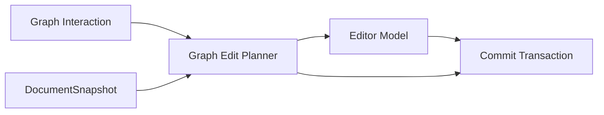

# Bidirectional Edit Pipeline

本文解释 `Editor <-> Graph` 双向编辑主链：哪些实体参与、两个方向如何流动、哪些边界绝不能被绕过。

本文只描述 `Editor <-> Graph` 双向编辑：

- 双向编辑约束
- 两个方向的数据流
- 与双向编辑直接相关的核心实体关系

## 核心实体

### Editor Model

承接文本编辑与 edits 应用的草稿实体。

### Graph Interaction

来自主图、子图工作区 graph pane、content pane 的编辑入口。

### Graph Edit Planner

基于 snapshot 和 path 生成 edits 或 replace fallback 的规划实体。

### Commit Transaction

把双向编辑结果重新提交回主文档主链。

### DocumentSnapshot

提供 planner 所依赖的 snapshot identity 和结构语义。

## 核心实体关系



## 双向编辑约束

### Editor → Graph

- Editor 改动回流 graph 时，提交必须回到主文档提交口
- 增量编辑需要绑定 base snapshot
- 不能在图层语义上另起一条“只更新 graph 不更新文档”的成功主链

### Graph → Editor

- Graph 不能直接写文档
- Graph 必须先走 planner
- planner 必须绑定 `documentKey + snapshotId + path`
- planner 返回 edits 时，仍要重新流回 `Editor Model`
- planner 返回 replace 时，也要显式经过整文提交语义

### fallback

- fallback 必须显式
- fallback reason 必须可见、可追踪
- 不能 silent no-op

## 数据流

### 1. Editor → Graph

```text
Editor 改动
  → Editor Model
  → Commit Transaction
  → Document Runtime
  → 新 snapshot / 新 graph
```

### 2. Graph → Editor

```text
Graph interaction
  → Graph Edit Planner
  → edits / replace
  → Editor Model
  → Commit Transaction
  → Document Runtime
  → 新 snapshot / 新 graph
```

### 3. 子图工作区 graph pane

```text
graph pane inline edit
  → Graph Edit Planner
  → edits / replace
  → Editor Model
  → Commit Transaction
```

### 4. 子图工作区 content pane

```text
content pane Monaco 草稿
  → Graph Edit Planner
  → edits / replace
  → Editor Model
  → Commit Transaction
```

## 子图工作区入口约束

- 子图工作区里的 graph pane 和 content pane 都只是双向编辑入口
- planner authority 不因入口不同而改变
- pane 分流、草稿持有方式、工作区生命周期等产品规则以 `./subgraph-workspace.md` 为准

## 检查清单

- Graph 是否绕过 planner 直接写文档
- planner 是否显式绑定 snapshot identity
- edits / replace 是否都重新流回统一提交口
- 不同入口是否共享同一套 planner 语义
- fallback 是否显式可见
